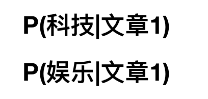
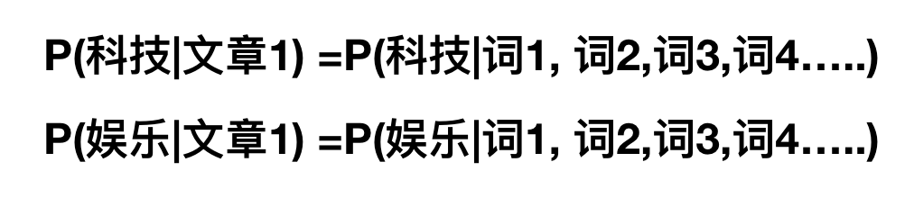

# 朴素贝叶斯

## 朴素贝叶斯 概述

贝叶斯分类是一类分类算法的总称，这类算法均以贝叶斯定理为基础，故统称为贝叶斯分类。本章首先介绍贝叶斯分类算法的基础——贝叶斯定理。最后，我们通过实例来讨论贝叶斯分类的中最简单的一种: **朴素贝叶斯分类**。

## 概率基础

### 概率(Probability)定义

- 概率定义为一件事情发生的可能性
  - 扔出一个硬币，结果头像朝上
  - 某天是晴天
- $$P(X)$$ : 取值在[0, 1]

那么其中有些问题我们计算的结果不正确，或者不知道计算，我们有固定的公式去计算

### 条件概率与联合概率

- 联合概率：包含多个条件，且所有条件同时成立的概率
  - 记作：$$P(A,B)$$
  - 特性：$$P(A, B) = P(A)P(B)$$
- 条件概率：就是事件A在另外一个事件B已经发生条件下的发生概率
  - 记作：$$P(A|B)$$
  - 特性：$$P(A1,A2|B) = P(A1|B)P(A2|B)$$

> 注意：此条件概率的成立，**是由于A1,A2相互独立的结果**(记忆)

这样我们计算结果为：
$$p(程序员, 匀称) =  P(程序员)P(匀称) =3/7*(4/7) = 12/49 $$
$$P(产品, 超重|喜欢) = P(产品|喜欢)P(超重|喜欢)=1/2 *  1/4 = 1/8$$


**那么，我们知道了这些知识之后，继续回到我们的主题中。朴素贝叶斯如何分类，这个算法经常会用在文本分类，那就来看文章分类是一个什么样的问题？**



这个了类似一个条件概率，那么仔细一想，给定文章其实相当于给定什么？结合前面我们将文本特征抽取的时候讲的？所以我们可以理解为



**但是这个公式怎么求？前面并没有参考例子，其实是相似的，我们可以使用贝叶斯公式去计算**

### 朴素贝叶斯场景

机器学习的一个重要应用就是文档的自动分类。

在文档分类中，整个文档（如一封电子邮件）是实例，而电子邮件中的某些元素则构成特征。我们可以观察文档中出现的词，并把每个词作为一个特征，而每个词的出现或者不出现作为该特征的值，这样得到的特征数目就会跟词汇表中的词的数目一样多。

朴素贝叶斯是上面介绍的贝叶斯分类器的一个扩展，是用于文档分类的常用算法。下面我们会进行一些朴素贝叶斯分类的实践项目。

## 项目案例1: 屏蔽社区留言板的侮辱性言论

#### 项目概述

构建一个快速过滤器来屏蔽在线社区留言板上的侮辱性言论。如果某条留言使用了负面或者侮辱性的语言，那么就将该留言标识为内容不当。对此问题建立两个类别: 侮辱类和非侮辱类，使用 1 和 0 分别表示。

#### 开发流程


- 收集数据: 可以使用任何方法
- 准备数据: 从文本中构建词向量
- 分析数据: 检查词条确保解析的正确性
- 训练算法: 从词向量计算概率
- 测试算法: 根据现实情况修改分类器
- 使用算法: 对社区留言板言论进行分类

#### 收集数据: 可以使用任何方法

```python
#本例是我们自己构造的词表

#从numpy中导入所需的函数
from numpy import array,ones,log
#词表到向量的转换函数
def loadDataSet():
    postingList = [['my','dog','has','flea','problems','help','please'],
                   ['maybe','not','take','him','to','dog','park','stupid'],
                   ['my','dalmation','is','so','cute','I','love','him'],
                   ['stop','posting','stupid','worthless','garbage'],
                   ['mr','licks','ate','my','steak','how','to','stop','him'],
                   ['quit','buying','worthless','dog','food','stupid']]
    classVec = [0,1,0,1,0,1]      #1,侮辱  0,正常
    return postingList,classVec
loadDataSet()
```

#### 准备数据: 从文本中构建词向量

```python
def createVocabList(dataSet):
    vocabSet = set([])  #调用set方法,创建一个空集
    for document in dataSet:
        vocabSet = vocabSet | set(document)     #创建两个集合的并集
    return list(vocabSet)

def setOfWords2Vec(vocabList,inputSet):
    returnVec = [0]*len(vocabList)   #创建一个所含元素都为0的向量
    for word in inputSet:
        if word in vocabList:
            returnVec[vocabList.index(word)] = 1
        else:
            print("the word:%s is not in my Vocabulary" % word)
    return returnVec


def bagOfWords2VecMN(vocabList,inputSet):
    returnVec = [0]*len(vocabList)   #创建一个所含元素都为0的向量
    for word in inputSet:
        if word in vocabList:
            returnVec[vocabList.index(word)] += 1
    return returnVec
createVocabList,setOfWords2Vec,bagOfWords2VecMN
```

#### 分析数据: 检查词条确保解析的正确性

检查函数执行情况，检查词表，不出现重复单词，需要的话，可以对其进行排序。

```python
%pprint on
listOPosts, listClasses = loadDataSet()
myVocabList = createVocabList(listOPosts)
myVocabList
```

```python
print(setOfWords2Vec(myVocabList, listOPosts[0]))
```

#### 训练算法: 从词向量计算概率

现在已经知道了一个词是否出现在一篇文档中，也知道该文档所属的类别。接下来我们重写贝叶斯准则，将之前的 x, y 替换为 w. 粗体的 w 表示这是一个向量，即它由多个值组成。在这个例子中，数值个数与词汇表中的词个数相同。

重写贝叶斯准则

我们使用上述公式，对每个类计算该值，然后比较这两个概率值的大小。

问: 上述代码实现中，为什么没有计算P(w)？

答：根据上述公式可知，我们右边的式子等同于左边的式子，由于对于每个ci，P(w)是固定的。并且我们只需要比较左边式子值的大小来决策分类，那么我们就可以简化为通过比较右边分子值得大小来做决策分类。

首先可以通过类别 i (侮辱性留言或者非侮辱性留言)中的文档数除以总的文档数来计算概率 p(ci) 。接下来计算 p(w | ci) ，这里就要用到朴素贝叶斯假设。如果将 w 展开为一个个独立特征，那么就可以将上述概率写作 p(w0, w1, w2...wn | ci) 。这里假设所有词都互相独立，该假设也称作条件独立性假设（例如 A 和 B 两个人抛骰子，概率是互不影响的，也就是相互独立的，A 抛 2点的同时 B 抛 3 点的概率就是 1/6 * 1/6），它意味着可以使用 p(w0 | ci)p(w1 | ci)p(w2 | ci)...p(wn | ci) 来计算上述概率，这样就极大地简化了计算的过程。

朴素贝叶斯分类器训练函数

```python
#朴素贝叶斯分类器训练集
def trainNB0(trainMatrix,trainCategory):  #传入参数为文档矩阵，每篇文档类别标签所构成的向量
    numTrainDocs = len(trainMatrix)      #文档矩阵的长度
    numWords = len(trainMatrix[0])       #第一个文档的单词个数
    pAbusive = sum(trainCategory)/float(numTrainDocs)  #任意文档属于侮辱性文档概率
    #p0Num = zeros(numWords);p1Num = zeros(numWords)        #初始化两个矩阵，长度为numWords，内容值为0
    p0Num = ones(numWords);p1Num = ones(numWords)        #初始化两个矩阵，长度为numWords，内容值为1
    #p0Denom = 0.0;p1Denom = 0.0                         #初始化概率
    p0Denom = 2.0;p1Denom = 2.0 
    for i in range(numTrainDocs):
        if trainCategory[i]==1:
            p1Num +=trainMatrix[i]
            p1Denom += sum(trainMatrix[i])
        else:
            p0Num +=trainMatrix[i]
            p0Denom += sum(trainMatrix[i])
    #p1Vect = p1Num/p1Denom #对每个元素做除法
    #p0Vect = p0Num/p0Denom
    p1Vect = log(p1Num/p1Denom)
    p0Vect = log(p0Num/p0Denom)
    return p0Vect,p1Vect,pAbusive
trainNB0
```

#### 测试算法: 根据现实情况修改分类器

在利用贝叶斯分类器对文档进行分类时，要计算多个概率的乘积以获得文档属于某个类别的概率，即计算 p(w0|1) * p(w1|1) * p(w2|1)。如果其中一个概率值为 0，那么最后的乘积也为 0。为降低这种影响，可以将所有词的出现数初始化为 1，并将分母初始化为 2 （取1 或 2 的目的主要是为了保证分子和分母不为0，大家可以根据业务需求进行更改）。

另一个遇到的问题是下溢出，这是由于太多很小的数相乘造成的。当计算乘积 p(w0|ci) * p(w1|ci) * p(w2|ci)... p(wn|ci) 时，由于大部分因子都非常小，所以程序会下溢出或者得到不正确的答案。（用 Python 尝试相乘许多很小的数，最后四舍五入后会得到 0）。一种解决办法是对乘积取自然对数。在代数中有 ln(a * b) = ln(a) + ln(b), 于是通过求对数可以避免下溢出或者浮点数舍入导致的错误。同时，采用自然对数进行处理不会有任何损失。

下图给出了函数 f(x) 与 ln(f(x)) 的曲线。可以看出，它们在相同区域内同时增加或者减少，并且在相同点上取到极值。它们的取值虽然不同，但不影响最终结果。

```python
#朴素贝叶斯分类函数
def classifyNB(vec2Classify,p0Vec,p1Vec,pClass1):
    p1 = sum(vec2Classify * p1Vec) + log(pClass1)   #元素相乘
    p0 = sum(vec2Classify * p0Vec) + log(1.0 - pClass1)
    if p1>p0:
        return 1
    else:
        return 0

def testingNB(testinput):
    listOPosts,listClasses = loadDataSet()   #产生文档矩阵和对应的标签
    myVocabList = createVocabList(listOPosts) #创建并集
    trainMat = []   #创建一个空的列表
    for postinDoc in listOPosts:
        trainMat.append(setOfWords2Vec(myVocabList,postinDoc))  #使用词向量来填充trainMat列表
    p0V,p1V,pAb = trainNB0(array(trainMat),array(listClasses))  #训练函数
    thisDoc = array(setOfWords2Vec(myVocabList,testinput)) #声明矩阵
    print(testinput,'classified as:',classifyNB(thisDoc,p0V,p1V,pAb))
classifyNB,testingNB
```

#### 使用算法: 对社区留言板言论进行分类

```python
testingNB(['love','my','dalmation'])
```

## 总结

- 优点：
  - 朴素贝叶斯模型发源于古典数学理论，有稳定的分类效率。
  - 对缺失数据不太敏感，算法也比较简单，常用于文本分类。
  - 分类准确度高，速度快
- 缺点：
  - 由于使用了样本属性独立性的假设，所以如果特征属性有关联时其效果不好

## 作业：

- 说明条件概率与联合概率
- 说明贝叶斯公式、以及特征独立的关系
- 记忆贝叶斯公式
- 知道拉普拉斯平滑系数
- 应用贝叶斯公式实现概率的计算