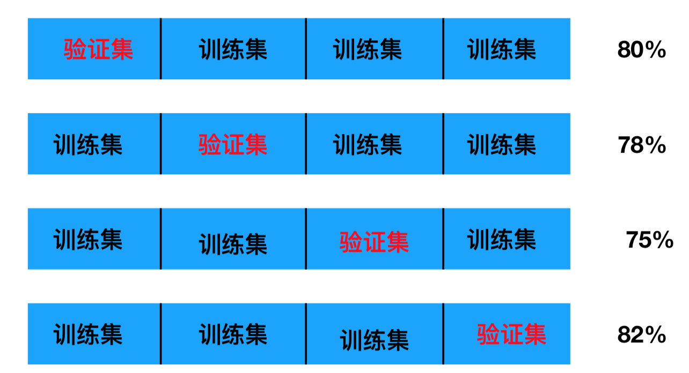

# 模型选择与调优,保存和加载

## 为什么需要交叉验证

交叉验证目的：**为了让被评估的模型更加准确可信**

## 什么是交叉验证(cross validation)

交叉验证：将拿到的训练数据，分为训练和验证集。以下图为例：将数据分成5份，其中一份作为验证集。然后经过5次(组)的测试，每次都更换不同的验证集。即得到5组模型的结果，取平均值作为最终结果。又称5折交叉验证。

### 分析

我们之前知道数据分为训练集和测试集，但是**为了让从训练得到模型结果更加准确。**做以下处理

- 训练集：训练集+验证集
- 测试集：测试集



问题：那么这个只是对于参数得出更好的结果，那么怎么选择或者调优参数呢？

### 超参数搜索-网格搜索(Grid Search)

通常情况下，**有很多参数是需要手动指定的（如k-近邻算法中的K值），这种叫超参数**。但是手动过程繁杂，所以需要对模型预设几种超参数组合。**每组超参数都采用交叉验证来进行评估。最后选出最优参数组合建立模型。**


### 模型选择与调优

- `sklearn.model_selection.GridSearchCV(estimator, param_grid=None,cv=None)`
  - 对估计器的指定参数值进行详尽搜索
  - estimator：估计器对象
  - param_grid：估计器参数(dict){“n_neighbors”:[1,3,5]}
  - cv：指定几折交叉验证
  - fit：输入训练数据
  - score：准确率
  - 结果分析：
    - best*score*:在交叉验证中验证的最好结果_
    - best*estimator*：最好的参数模型
    - cv*results*:每次交叉验证后的验证集准确率结果和训练集准确率结果

## 模型的保存与加载

当训练或者计算好一个模型之后，那么如果别人需要我们提供结果预测，就需要保存模型（主要是保存算法的参数）

**api**

- `from sklearn.externals import joblib`
  - 保存：joblib.dump(rf, 'test.pkl')
  - 加载：estimator = joblib.load('test.pkl')

#### 练习：线性回归的模型保存加载案例
```python
# 使用线性模型进行预测
# 使用正规方程求解
lr = LinearRegression()
# 此时在干什么？
lr.fit(x_train, y_train)
# 保存训练完结束的模型
joblib.dump(lr, "test.pkl")
```

- 加载

```python
# 通过已有的模型去预测房价
model = joblib.load("test.pkl")
print("从文件加载进来的模型预测房价的结果：", std_y.inverse_transform(model.predict(x_test)))
```

## 学习目标

- 说明交叉验证过程
- 说明超参数搜索过程
- 应用GridSearchCV实现算法参数的调优
- Facebook签到位置预测调优