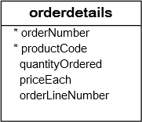

# MySQL having子句

在本教程中，您将学习如何使用MySQL `HAVING`子句为行分组或聚合组指定过滤条件。

## MySQL HAVING子句简介

在[SELECT语句](./select.html)中使用`HAVING`子句来指定一组行或聚合的过滤条件。

`HAVING`子句通常与[GROUP BY](./groupby.html)子句一起使用，以根据指定的条件过滤分组。如果省略`GROUP BY`子句，则`HAVING`子句的行为与`WHERE`子句类似。

> 请注意，`HAVING`子句将过滤条件应用于每组分行，而`WHERE`子句将过滤条件应用于每个单独的行。

## MySQL HAVING子句示例

**[准备环境](./setup.html)**

让我们举一些使用`HAVING`子句的例子来看看它是如何工作。 我们将使用示例数据库中的`orderdetails`表进行演示。



```sql
desc orderdetails;
```

可以使用`GROUP BY`子句来获取订单号，查看每个订单销售的商品数量和每个销售总额：

```sql
SELECT 
    ordernumber,
    SUM(quantityOrdered) AS itemsCount,
    SUM(priceeach*quantityOrdered) AS total
FROM
    orderdetails
GROUP BY ordernumber;
```

现在，可以通过使用`HAVING`子句查询(过滤)哪些订单的总销售额大于`55000`，如下所示：

```sql
SELECT 
    ordernumber,
    SUM(quantityOrdered) AS itemsCount,
    SUM(priceeach*quantityOrdered) AS total
FROM
    orderdetails
GROUP BY ordernumber
HAVING total > 55000;
```

可以使用逻辑运算符(如`OR`和`AND`)在`HAVING`子句中构造复杂过滤条件。 假设您想查找哪些订单的总销售额大于`50000`，并且包含超过`600`个项目，则可以使用以下查询：

```sql
SELECT 
    ordernumber,
    SUM(quantityOrdered) AS itemsCount,
    SUM(priceeach*quantityOrdered) AS total
FROM
    orderdetails
GROUP BY ordernumber
HAVING total > 50000 AND itemsCount > 600;
```

假设您想查找所有已发货(`status='Shiped'`)的订单和总销售额大于`55000`的订单，可以使用[INNER JOIN](./join-inner.html)子句将`orders`表与`orderdetails`表一起使用，并在`status`列和总金额(`total`)列上应用条件，如以下查询所示：

```sql
SELECT 
    a.ordernumber, status, SUM(priceeach*quantityOrdered) total
FROM
    orderdetails a
        INNER JOIN
    orders b ON b.ordernumber = a.ordernumber
GROUP BY ordernumber, status
HAVING status = 'Shipped' AND total > 5000;
```

`HAVING`子句仅在使用`GROUP BY`子句生成高级报告的输出时才有用。 例如，您可以使用`HAVING`子句来回答统计问题，例如在本月，本季度或今年总销售额超过`10000`的订单。

在本教程中，您已经学习了如何使用具有`GROUP BY`子句的MySQL `HAVING`子句为行分组或聚合分组指定过滤器条件。