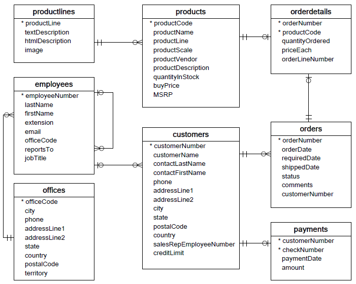

# MySQL 环境安装配置 			

## 本课程在线环境的安装

### 安装

```shell
#更新源及安装
apt update && apt install mysql-server -y
```

以上安装MySQL服务器的过程会创建MySQL用户`root`，默认密码为空。

并创建一个MySQL配置文件`mysqld.cnf`，位于`/etc/mysql/mysql.conf.d/`

你可以在`/usr/bin`中找到所有与MySQL相关的二进制文件。

所有数据表和数据库将在`/var/lib/mysql`目录中创建。

在成功安装MySQL后，一些基础表会表初始化，在服务器启动后，你可以通过简单的测试来验证MySQL是否工作正常。

使用 mysqladmin 工具来获取服务器状态，linux上该二进制文件位于`/usr/bin/`

```shell
#验证安装
mysqladmin --version
```

如果以上命令执行后未输入任何信息，说明你的MySQL未安装成功。

### 启动MySQL服务

首先，我们需要通过以下命令来检查MySQL服务器是否启动：

```shell
service mysql status
```

如果MySQL已经启动，以上命令将输出MySQL服务的状态。如果MySQL未启动，你可以使用以下命令来启动MySQL服务器:

```shell
service mysql start
```

### 使用MySQL客户端方式连接服务,并执行简单命令验证

您可以使用MySQL二进制方式进入到MySQL命令提示符下来连接MySQL数据库。

以下是从命令行中连接MySQL服务器的简单实例：-u参数后边代表进行连接的用户是`root`，-p代表该用户的密码。默认为空。

在上边的默认安装下，MySQL服务器的密码为空，所以本实例不需要输入密码。

```shell
mysql
```

在出现 `Enter password: `直接按回车，即会出现 

```
Your MySQL connection id is 1
Server version: 5.7.29-0ubuntu0.18.04.1 (Ubuntu)

Copyright (c) 2000, 2020, Oracle and/or its affiliates. All rights reserved.

Oracle is a registered trademark of Oracle Corporation and/or its
affiliates. Other names may be trademarks of their respective
owners.

Type 'help;' or '\h' for help. Type '\c' to clear the current input statement.

mysql> 
```

在登录成功后会出现 `mysql>` 命令提示窗口，你可以在上面执行任何 SQL 语句。

这说明你已经成功连接到 MySQL 服务器上，你可以在` mysql > `提示符后执行MySQL 命令,例如下方命令，来查询目前MySQL服务上存在的数据库。

在以上实例中，我们使用了root用户登录到MySQL服务器，当然你也可以使用其他MySQL用户登录。

如果用户权限足够，任何用户都可以在MySQL的命令提示窗口中进行SQL操作。

例如：

```sql
SHOW DATABASES;
```


会出现 

```
+--------------------+
| Database           |
+--------------------+
| information_schema |
| mysql              |
| performance_schema |
| sys                |
+--------------------+
4 rows in set (0.00 sec)
```

### 导入MySQL示例数据库
到此本课程环境安装并验证完成。我们开始导入示例数据库

在本MySQL教程中，大部分操作是基于`classicmodels`这个数据库作为学习MySQL示例数据库，这样的话有助于您快速有效地使用MySQL。`classicmodels`数据库是一个典型汽车零售商数据库模型。它包含典型的业务数据，如客户，产品，销售订单，销售订单等。

我们在MySQL教程中使用此示例数据库来演示从简单查询到复杂存储过程的许多MySQL功能。

## 导入MySQL示例数据库
```sql
#创建一个空的数据库并使用它
CREATE DATABASE IF NOT EXISTS classicmodels DEFAULT CHARSET utf8;
USE classicmodels;
```

```sql
#导入数据
source /share/datasets/mysql-classicmodels.sql;
```
```sql
#查询导入数据库classicmodels中的表offices
select city,phone,country from `offices`;
```

上面语句首先将当前数据库切换到`classicmodels`数据库下，并从`office`表查询数据。

如果您看到返回的客户数据，说明已成功将示例数据库(`classicmodels`)导入MySQL数据库服务器了。

## MySQL示例数据库结构

MySQL示例数据库模式由以下表组成：

- `customers`: 存储客户的数据。
- `products`: 存储汽车的数据。
- `productLines`: 存储产品类别数据。
- `orders`: 存储客户订购的销售订单。
- `orderDetails`: 存储每个销售订单的订单产品数据项。
- `payments`: 存储客户订单的付款数据信息。
- `employees`: 存储所有员工信息以及组织结构，例如，直接上级(谁向谁报告工作)。
- `offices`: 存储销售处数据，类似于各个分公司。

表与表之间的关系，请参考以下ER图 - 



### 配置成功

到此我们已经成功安装了mysq，启动了服务，并导入了课程学习所需要的示例数据库，您就可以开始进行本课程下一步的学习了。

注：当云环境的生命周期失效后，需要重新进行安装。
