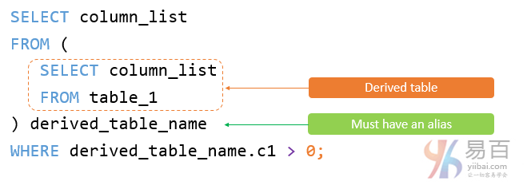

# MySQL 派生表

在本教程中，您将了解和学习MySQL派生表以及如何简化复杂查询。

## 1. MySQL派生表介绍

派生表是从[SELECT语句](./select.html)返回的虚拟表。派生表类似于临时表，但是在`SELECT`语句中使用派生表比[临时表](./table-temporary.html)简单得多，因为它不需要创建临时表的步骤。

**术语:\***派生表*和[子查询](./subquery.html)通常可互换使用。当`SELECT`语句的`FROM`子句中使用独立子查询时，我们将其称为派生表。

以下说明了使用派生表的查询：



> 请注意，独立子查询是一个子查询，可独立于包含该语句的执行语句。

与子查询不同，派生表必须具有[别名](./alias.html)，以便稍后在查询中引用其名称。 如果派生表没有别名，MySQL将发出以下错误：

```
Every derived table must have its own alias.
```

以下说明了使用派生表的SQL的语法：

```sql
SELECT 
    column_list
FROM
    (SELECT 
        column_list
    FROM
        table_1) derived_table_name;
WHERE derived_table_name.c1 > 0;
```

## 简单的MySQL派生表示例

以下查询从示例数据库中的`orders`表和`orderdetails`表中获得`2013`年销售收入最高的前`5`名产品：


参考以下查询语句 - 

```sql
SELECT 
    productCode, 
    ROUND(SUM(quantityOrdered * priceEach)) sales
FROM
    orderdetails
        INNER JOIN
    orders USING (orderNumber)
WHERE
    YEAR(shippedDate) = 2013
GROUP BY productCode
ORDER BY sales DESC
LIMIT 5;
```

您可以使用此查询的结果作为派生表，并将其与`products`表相关联，`products`表的结构如下所示：

```sql
desc products;
```

参考以下查询语句 - 

```sql
SELECT 
    productName, sales
FROM
    (SELECT 
        productCode, 
        ROUND(SUM(quantityOrdered * priceEach)) sales
    FROM
        orderdetails
    INNER JOIN orders USING (orderNumber)
    WHERE
        YEAR(shippedDate) = 2013
    GROUP BY productCode
    ORDER BY sales DESC
    LIMIT 5) top5products2013
INNER JOIN
    products USING (productCode);
```

在上面这个例子中：

- 首先，执行子查询来创建一个结果集或派生表。
- 然后，在`productCode`列上使用`products`表连接`top5product2013`派生表的外部查询。

##  一个更复杂的MySQL派生表示例

假设必须将`2013`年的客户分为`3`组：铂金，白金和白银。 此外，需要了解每个组中的客户数量，具体情况如下：

- 订单总额大于`100000`的为铂金客户；
- 订单总额为`10000`至`100000`的为黄金客户
- 订单总额为小于`10000`的为银牌客户

要构建此查询，首先，您需要使用CASE表达式和[GROUP BY](./groupby.html)子句将每个客户放入相应的分组中，如下所示：

```sql
SELECT 
    customerNumber,
    ROUND(SUM(quantityOrdered * priceEach)) sales,
    (CASE
        WHEN SUM(quantityOrdered * priceEach) < 10000 THEN 'Silver'
        WHEN SUM(quantityOrdered * priceEach) BETWEEN 10000 AND 100000 THEN 'Gold'
        WHEN SUM(quantityOrdered * priceEach) > 100000 THEN 'Platinum'
    END) customerGroup
FROM
    orderdetails
        INNER JOIN
    orders USING (orderNumber)
WHERE
    YEAR(shippedDate) = 2013
GROUP BY customerNumber 
ORDER BY sales DESC;
```

然后，可以使用此查询作为派生表，并按如下所示进行分组：

```sql
SELECT 
    customerGroup, 
    COUNT(cg.customerGroup) AS groupCount
FROM
    (SELECT 
        customerNumber,
            ROUND(SUM(quantityOrdered * priceEach)) sales,
            (CASE
                WHEN SUM(quantityOrdered * priceEach) < 10000 THEN 'Silver'
                WHEN SUM(quantityOrdered * priceEach) BETWEEN 10000 AND 100000 THEN 'Gold'
                WHEN SUM(quantityOrdered * priceEach) > 100000 THEN 'Platinum'
            END) customerGroup
    FROM
        orderdetails
    INNER JOIN orders USING (orderNumber)
    WHERE
        YEAR(shippedDate) = 2013
    GROUP BY customerNumber) cg
GROUP BY cg.customerGroup;
```

本教程中，您已经学会了如何使用`FROM`子句中的子查询作为MySQL派生表来简化复杂查询。