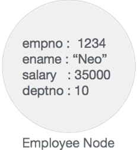

# Neo4j 基础
## Neo4j数据模型 属性图数据模型

Neo4j图数据库遵循属性图模型来存储和管理其数据。

以下是属性图模型的主要功能-

- 该模型以节点，关系和属性表示数据
- 属性是键值对
- 节点用圆圈表示，关系用箭头键表示
- 关系有方向：单向和双向
- 每个关系都包含“开始节点”或“从节点”以及“到节点”或“结束节点”
- 节点和关系都包含属性
- 关系连接节点

在属性图数据模型中，关系应该是有方向的。如果我们尝试创建没有方向的关系，那么它将抛出错误消息。

同样在Neo4j中，关系也应该是定向的。如果我们试图创建没有方向的关系，那么Neo4j将抛出一条错误消息，指出“关系应该是有方向的”。

Neo4j图形数据库将其所有数据存储在“节点和关系”中。我们既不需要任何其他RRBMS数据库，也不需要任何SQL数据库来存储Neo4j数据库数据。它以其本机格式的图形式存储其数据。

Neo4j使用本机GPE（图形处理引擎）来处理其本机图形存储格式。

Graph DB数据模型的主要构建模块为-

- 节点数
- 人际关系
- 物产

以下是属性图的简单示例。


在这里，我们用圆表示了节点。关系用箭头表示。关系是定向的。我们可以用属性（键值对）表示Node的数据。在此示例中，我们已在“节点的圈子”中表示了每个节点的Id属性。

# Neo4j 积木

Neo4j图形数据库具有以下构建基块-

- 节点数
- 物产
- 人际关系
- 标签
- 资料浏览器

## 节点

节点是图的基本单位。它包含具有键值对的属性，如下图所示。



此处，节点名称=“ Employee”，它包含一组属性作为键值对。

## 物产

属性是一个键值对，用于描述图形节点和关系。

```cql
Key = Value 
```

其中Key是字符串，而Value可以使用任何Neo4j数据类型表示。

## 关系

关系是图形数据库的另一个主要构建块。如下图所示，它连接两个节点。


在这里，Emp和Dept是两个不同的节点。“ WORKS_FOR”是Emp和Dept节点之间的关系。

如它所表示的，从Emp到Dept的箭头标记，此关系描述-

```cql
Emp WORKS_FOR Dept 
```

每个关系包含一个起点和一个终点。

在此，“ Emp”是开始节点，“ Dept”是结束节点。

由于此关系箭头标记表示从“ Emp”节点到“ Dept”节点的关系，因此该关系被称为“传入关系”到“ Dept”节点和“传出关系”到“ Emp”节点。

像节点一样，关系也可以包含属性作为键值对。


在此，“ WORKS_FOR”关系具有一个属性作为键值对。

```cql
Id = 123 
```

它表示此关系的ID。

## 标签

标签将通用名称与一组节点或关系相关联。节点或关系可以包含一个或多个标签。我们可以为现有节点或关系创建新标签。我们可以从现有节点或关系中删除现有标签。

从上图中，我们可以看到有两个节点。

左侧节点具有标签：“ Emp”，右侧节点具有标签：“ Dept”。

这两个节点之间的关系也具有标签：“ WORKS_FOR”。

**注意** -Neo4j将数据存储在节点或关系的属性中。
