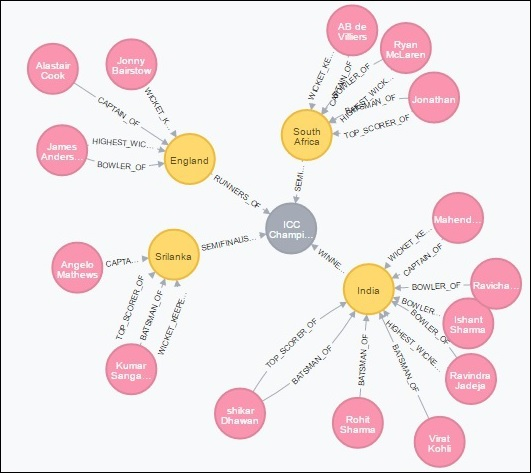

# Neo4j Where子句

### 句法

以下是WHERE子句的语法。

```cql
MATCH (label)  
WHERE label.country = "property" 
RETURN label 
```

### 例

在继续该示例之前，如下所示在数据库中创建五个节点。

```cql
CREATE(Dhawan:player{name:"shikar Dhawan", YOB: 1985, runs:363, country: "India"}
CREATE(Jonathan:player{name:"Jonathan Trott", YOB:1981, runs:229, country:"South Africa"}
CREATE(Sangakkara:player{name:"Kumar Sangakkara", YOB:1977, runs:222, 
   country:"Srilanka"})
CREATE(Rohit:player{name:"Rohit Sharma", YOB: 1987, runs:177, country:"India"})
CREATE(Virat:player{name:"Virat Kohli", YOB: 1988, runs:176, country:"India"})
CREATE(Ind:Country {name: "India", result: "Winners"})
```

以下是示例Cypher Query，该查询使用WHERE子句返回属于印度国家/地区的所有玩家（节点）。

```cql
MATCH (player)  
WHERE player.country = "India" vs
RETURN player 
```

## 在多个条件的子句中

您还可以使用WHERE子句来验证多个条件。

### 句法

以下是在多个条件下使用Neo4j中的WHERE子句的语法。

```cql
MATCH (emp:Employee)  
WHERE emp.name = 'Abc' AND emp.name = 'Xyz' 
RETURN emp 
```

### 例

以下是一个示例Cypher查询，该查询使用两个条件过滤Neo4j数据库中的节点。

```cql
MATCH (player)  
WHERE player.country = "India" AND player.runs >=175 
RETURN player 
```

## 使用与where子句的关系

您还可以使用Where子句使用关系过滤节点。

### 例

假设我们在数据库中有以下图形。



以下是一个示例密码查询，它使用WHERE子句检索印度的最佳得分手，如下所示。

```cql
MATCH (n) 
WHERE (n)-[: TOP_SCORER_OF]->( {name: "India", result: "Winners"}) 
RETURN n 
```

执行后，您可以观察到Neo4j返回了该节点，该节点与该国家/地区具有TOP_SCORER_OF关系，且该节点的名称为India。