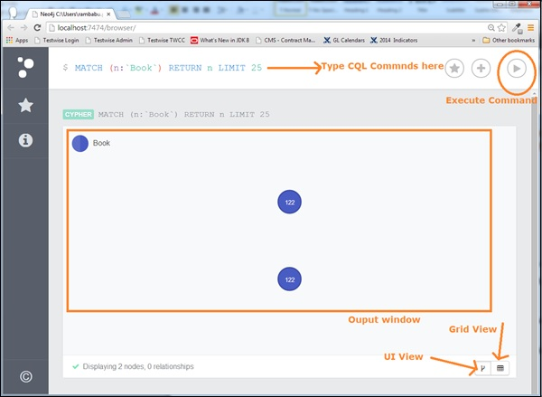

# Neo4j 环境安装配置

## 本课程在线环境的安装

**安装JDK 11**

```bash
#复制JDK相关文件
cp /share/tar/jdk-11.0.6_linux-x64_bin.tar.gz  /usr/local/
#对文件进行解压缩，-C 指定解压后，将文件放到/usr/local目录下
tar -xzvf /usr/local/jdk-11.0.6_linux-x64_bin.tar.gz -C /usr/local/
mv /usr/local/jdk-11.0.6 /usr/local/java

#配置相关环境变量
echo 'export JAVA_HOME=/usr/local/java' >> ~/.bashrc
echo 'export PATH=$JAVA_HOME/bin:$PATH' >> ~/.bashrc
source ~/.bashrc  #生效环境变量
#验证java安装，测试环境变量是否配置正确。如果出现正确的版本信息提示，则安装成功
java -version
```

**安装Neo4j**

```bash
cp /share/tar/neo4j-community-4.0.3-unix.tar.gz /usr/local
#对文件进行解压缩，-C 指定解压后，将文件放到/usr/local目录下
tar -xzvf /usr/local/neo4j-community-4.0.3-unix.tar.gz -C /usr/local/
mv /usr/local/neo4j-community-4.0.3 /usr/local/neo4j

#下面来修改环境变量：系统环境变量或用户环境变量。
echo 'export PATH=/usr/local/neo4j/bin:$PATH' >> ~/.bashrc
source ~/.bashrc  #生效环境变量
#验证neo4j安装，测试环境变量是否配置正确。如果出现正确的版本信息提示，则安装成功
neo4j version
```

### 源在线安装

```bash
#更新源及安装
wget -O - https://debian.neo4j.com/neotechnology.gpg.key | apt-key add -
echo 'deb https://debian.neo4j.com stable 4.0' | tee /etc/apt/sources.list.d/neo4j.list
apt-get update && apt install neo4j
```
```bash
#修改Neo4j服务的配置文件，将该行改为dbms.connector.http.listen_address的参数修改为80端口
vim /etc/neo4j/neo4j.conf 
```

```
dbms.connector.http.listen_address=:80
```

```bash
#启动服务并查看状态
neo4j restart  && neo4j status
```

**Neo4j数据浏览器**

配置好后，我们可以使用以下URL[浏览器](Dyanmicpod.com)，或点击加号在当前页面打开Neo4j数据浏览器



<iframe src="//player.bilibili.com/player.html?aid=73161752&bvid=BV1LE411y7GW&cid=125137919&page=1" scrolling="no" border="0" frameborder="no" framespacing="0" allowfullscreen="true"> </iframe>
Neo4j数据浏览器用于执行CQL命令并查看输出。

在这里，我们需要在美元提示符下执行所有CQL命令：**“ $”**

在美元符号后键入命令，然后单击“执行”按钮以运行命令。

它与Neo4j数据库服务器进行交互，检索并在美元提示下方显示结果。

使用“ VI查看”按钮以图表格式查看结果。上图以“ UI视图”格式显示了结果。

使用“网格视图”按钮在网格视图中查看结果。下图以“网格视图”格式显示了相同的结果。
