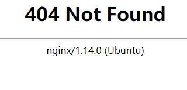

# Nginx 示例5:自定义错误页404

访问一个不存在的页面:{url}/pagedontexist.html



**创建自己的404.html页面，并放于网站根目录**

```bash
echo 'Sorry,You page was lost!!!' >> /var/www/html/404.html
```

**修改配置文件`/etc/nginx/sites-enabled/default `**

```bash
vim /etc/nginx/sites-enabled/default 
```
在server 区域加入:`error_page 404 /404.html;`后保存后退出

**修改配置文件`/etc/nginx/nginx.conf`**

```bash
vim /etc/nginx/nginx.conf
```

在http区域加入：`fastcgi_intercept_errors on; `后保存后退出

**重载nginx**

```bash
nginx -s reload
```

**验证**

访问一个不存在的页面:{url}/pagedontexist.html,看看是什么提示

> 其它如500 等错误可以用同样的方法来配置。