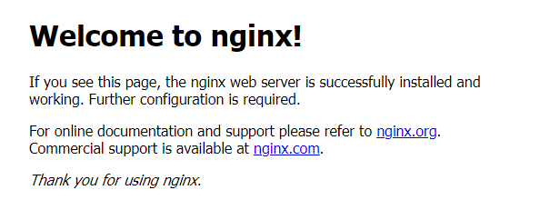

# nginx 环境安装配置 			

## 本课程在线环境的安装

### 安装

```bash
#更新源及安装
apt update && apt install nginx -y
#查看nginx版本
nginx -v
```

### 启动nginx服务

你可以使用以下命令来启动nginx服务器:

```bash
#启动nginx服务
service nginx start
```

我们需要通过以下命令来检查Nginx服务器是否启动：

```bash
service nginx status
```

如果是`* nginx is running`提示，则代表Ngnix服务正常运行。

使用浏览器打开{url},看到如下所示的字样，就代表nginx已经正确被访问到了。



### 环境安装完成

到此本课程环境安装并验证完成。您就可以开始进行本课程下一步的学习了。

注：当云环境的生命周期失效后，需要重新进行安装。
