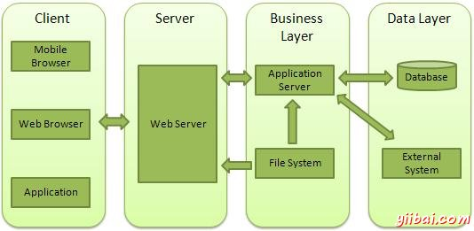

# node.js Web模块

## 什么是Web服务器?

Web服务器是处理由HTTP客户端发送的，如web浏览器的HTTP请求的软件应用程序，并返回响应于客户端网页. Web服务器通常伴随着图片，样式表和脚本的HTML文档。

大多数Web服务器支持服务器端脚本使用脚本语言或重定向到其执行从数据库中获取数据的特定任务的应用程序服务器，执行复杂的逻辑等。然后通过Web服务器发送结果到HTTP客户端。

Apache web服务器是最常用的网络服务器中的一个。它是一个开源项目。

## Web应用程序体系结构

Web应用程序通常分为四个层次：



- **Client** - 此层由Web浏览器，移动浏览器或应用程序，可以使HTTP请求到万维网服务器。
- **Server** - 这一层包括可拦截的要求由客户通过Web服务器响应。
- **Business** - 此层利用Web服务器执行所需的处理的应用程序服务器。这层交互以经由数据的基础上或一些外部程序数据层。
- **Data** - 此层由数据库或任何的数据来源。

## 	使用Node创建Web服务器

Node.js提供了可以用于创建任何HTTP服务器的客户端的HTTP模块。以下是HTTP服务器的最低限度的结构，它会在80端口侦听。

文件名:webserver.js

```js
var http = require('http');
var fs = require('fs');
var url = require('url');


// Create a server
http.createServer( function (request, response) {  
   // Parse the request containing file name
   var pathname = url.parse(request.url).pathname;
   
   // Print the name of the file for which request is made.
   console.log("Request for " + pathname + " received.");
   
   // Read the requested file content from file system
   fs.readFile(pathname.substr(1), function (err, data) {
      if (err) {
         console.log(err);
         // HTTP Status: 404 : NOT FOUND
         // Content Type: text/plain
         response.writeHead(404, {'Content-Type': 'text/html'});
      }else{	
         //Page found	  
         // HTTP Status: 200 : OK
         // Content Type: text/plain
         response.writeHead(200, {'Content-Type': 'text/html'});	
         
         // Write the content of the file to response body
         response.write(data.toString());		
      }
      // Send the response body 
      response.end();
   });   
}).listen(8081);

// Console will print the message
console.log('Server running at http://0.0.0.0:80/');
```

接下来，让我们创建以下名为index.html的HTML文件在创建server.js的同一目录下

文件名:index.html

```html
<html>
<head>
<title>Sample Page</title>
</head>
<body>
Hello node.js!
</body>
</html>
```

**现在运行这个node.js web服务**

```
node /share/lesson/node.js/webserver.js
```

**从web端请求Node.js服务器**

在浏览器中打开后端的web访问地址。{动态地址}

**同时在服务端查看日志输出了什么**

## 	使用Node创建Web客户端

Web客户端可以使用HTTP模块创建。让我们来看看下面的例子。

请修改以下文件中的host，改为您当前后端的web访问地址。

文件名:client.js

```js
var http = require('http');

// Options to be used by request 
var options = {
   host: '需要修改',
   port: '80',
   path: '/index.html'  
};

// Callback function is used to deal with response
var callback = function(response){
   // Continuously update stream with data
   var body = '';
   response.on('data', function(data) {
      body += data;
   });
   
   response.on('end', function() {
      // Data received completely.
      console.log(body);
   });
}
// Make a request to the server
var req = http.request(options, callback);
req.end();
```

```bash
node /share/lesson/node.js/client.js
```

**然后在服务端查看日志输出了什么**