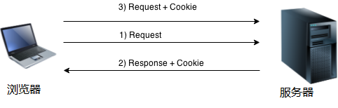

# PHP Cookie

PHP cookie是一个小段信息，存储在客户端浏览器中。它可用于识别用户。

Cookie在服务器端创建并保存到客户端浏览器。 每当客户端向服务器发送请求时，cookie都会嵌入请求。 这样，cookie数据信息可以在服务器端接收。



总之，可以在服务器端创建，发送和接收`cookie`。

> **注意：** PHP Cookie必须在``标记之前使用。

## PHP setcookie()函数

PHP `setcookie()`函数用于设置带有HTTP响应的cookie。当有`cookie`设置，可通过作用`$_COOKIE`超全局变量访问它。

**语法：**

```php
bool setcookie ( string $name [, string $value [, int $expire = 0 [, string $path   
[, string $domain [, bool $secure = false [, bool $httponly = false ]]]]]] )
```

**示例：**

文件名:cookie-set.php

```php
<?php  
setcookie("CookieName", "CookieValue");/* defining name and value only*/  
setcookie("CookieName", "CookieValue", time()+1*60*60);//using expiry in 1 hour(1*60*60 seconds or 3600 seconds)  
setcookie("CookieName", "CookieValue", time()+1*60*60, "/mypath/", "freeaihub.com", 1);
?>  
```

```bash
php /share/lesson/php/cookie-set.php
```

URL预览:`{url}/cookie-set.php`

## PHP $_COOKIE

PHP `$_COOKIE`超全局变量用于获取`cookie`。

**示例**

```php
$value=$_COOKIE["CookieName"];//returns cookie value
```

文件名:cookie-read.php

```php
<?php  
setcookie("user", "Maxsu");  
?>  
<html>  
<body>  
<?php  
if(!isset($_COOKIE["user"])) {  
    echo "Sorry, cookie is not found!";  
} else {  
    echo "<br/>Cookie Value: " . $_COOKIE["user"];  
}  
?>  
</body>  
</html>
```

再一刷新页面

```bash
php /share/lesson/php/cookie-read.php
```

URL预览:`{url}/cookie-set.php`

## PHP删除Cookie

如果您设置cookie的过期时间，则Cookie到期后将被删除。

文件名:cookie-delete.php

```php
<?php  
setcookie ("CookieName", "", time() - 3600);// set the expiration date to one hour ago  
?>
```

```bash
php /share/lesson/php/cookie-delete.php
```

URL预览:`{url}/cookie-delete.php`