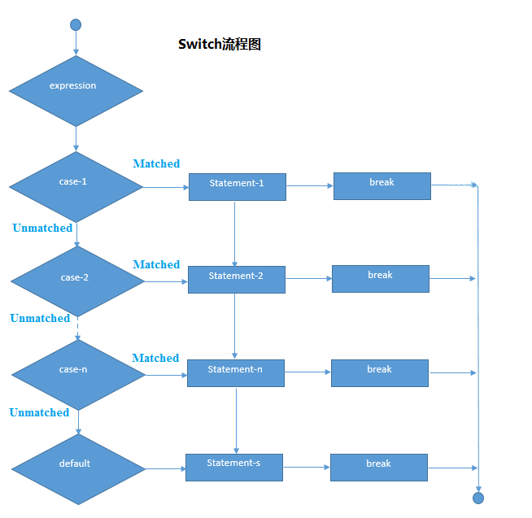

# PHP Switch语句

PHP **switch语句**用于从多个条件执行一个语句。 它的工作原理像PHP的`if-else-if`语句。

**语法**

```php
switch(expression){      
    case value1:      
         //code to be executed  
        break;  
    case value2:      
         //code to be executed  
         break;  
        ......      
    default:       
        code to be executed if all cases are not matched;    
}
```

**PHP switch流程图**



**PHP Switch示例代码**

文件名:logic-switch.php

```php
<?php    
    $num=20;    
    switch($num){    
        case 10:    
            echo("number is equals to 10");    
            break;    
        case 20:    
            echo("number is equal to 20");    
            break;    
        case 30:    
            echo("number is equal to 30");    
            break;    
        default:    
            echo("number is not equal to 10, 20 or 30");    
    }   
?>
```

```bash
php /share/lesson/php/logic-switch.php
```

URL预览:`{url}/logic-switch.php`