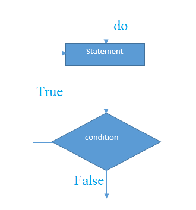

# PHP do...while循环

PHP中的 do…while循环可以用来遍历一组像php中的while循环的代码。只不过PHP中的do-while循环保证至少运行一次()。

它总是执行代码至少一次，因为在执行代码后检查条件。

**do…while循环语法**

```php
do{  
    //code to be executed  
}while(condition);
```

**执行流程图 **



**示例代码**

文件名:loop-dowhile.php

```php
<?php  
    $n=1;  
    do{  
        echo "$n<br/>";  
        $n++;  
    }while($n<=10);  
?>
```

```bash
php /share/lesson/php/loop-dowhile.php
```

URL预览:`{url}/loop-dowhile.php`