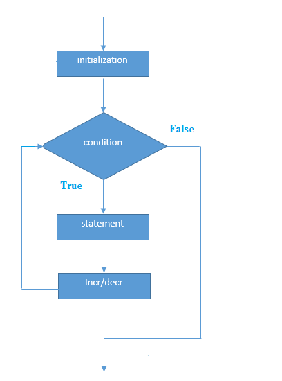

# PHP for循环

PHP **for循环**可以用来遍历一组指定的次数的代码。如果迭代次数已知，则应优先考虑使用**for循环**，否则使用`while`循环。
**for循环的语法**

```php
for(initialization; condition; increment/decrement){  
    //code to be executed  
}
```

**for循环流程图**


**示例代码-**

文件名:loop-for.php

```php
<?php  
    for($n=1;$n<=10;$n++){  
        echo "$n<br/>";  
    }  
?>
```

## PHP嵌套for循环

在PHP中,我们可以在for循环中使用for循环，它称为嵌套for循环。
在内部或嵌套for循环的情况下，对于每一次执行的外部for循环，将完全执行嵌套的内for循环。 如果外部for循环执行`3`次，内部for循环执行`3`次，内部for循环将一共要执行`9`次(第一个外部for循环为`3`次，第二个内for部循环为`3`次)。

**示例**

文件名:loop-fornested.php

```php
<?php  
for($i=1;$i<=3;$i++){  
    for($j=1;$j<=3;$j++){  
        echo "$i   $j<br/>";  
    }  
}  
?>
```

```bash
php /share/lesson/php/loop-fornested.php
```

URL预览:`{url}/loop-fornested.php`

## PHP foreach循环

PHP中的foreach循环循环用于遍历数组元素。

**语法**

```bash
<?php
foreach( $array as $var ){  
 //code to be executed  
}  
?>
```

**示例代码：**

文件名:loop-foreach.php

```bash
<?php  
$season=array("summer","winter","spring","autumn");  
foreach( $season as $arr ){  
    echo "Season is: $arr<br />";  
}  
?>
```

```bash
php /share/lesson/php/loop-foreach.php
```

URL预览:`{url}/loop-foreach.php`