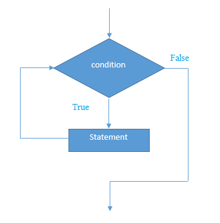

# PHP while循环

PHP **while循环**可以用于遍历一组代码，如:for循环。如果迭代次数未知，则应使用while循环。

**while循环语法**

```php
while(condition){  
    //code to be executed  
}
```

**替代语法**

```php
while(condition):  
//code to be executed  

endwhile;
```

**PHP While循环流程图**


**PHP While循环示例**

文件名:loop-while1.php

```php
<?php  
    $n=1;  
    while($n<=10){  
        echo "$n<br/>";  
        $n++;  
    }  
?>
```

```bash
php /share/lesson/php/loop-while1.php
```

URL预览:`{url}/loop-while1.php`

**替代示例**

文件名:loop-while2.php

```php
<?php  
    $n=1;  
    while($n<=10):  
        echo "$n<br/>";  
        $n++;  
    endwhile;  
?>
```

```bash
php /share/lesson/php/loop-while2.php
```

URL预览:`{url}/loop-while2.php`

## PHP嵌套while循环

我们可以在PHP中使用一个while循环另一个while循环中，它被称为嵌套while循环。

在内部或嵌套while循环的情况下，嵌套while循环对一个外部while循环完全执行。 如果外部while循环执行`3`次，嵌套while循环执行`3`次，则嵌套while循环将一共要执行`9`次(第一个外部循环为`3`次，第二个内部循环为`3`次)。

**示例**

文件名:loop-whilenested.php

```php
<?php  
    $i=1;  
    while($i<=3){  
        $j=1;  
        while($j<=3){  
            echo "$i   $j<br/>";  
            $j++;  
        }  
        $i++;  
    }  
?>
```

```bash
php /share/lesson/php/loop-whilenested.php
```

URL预览:`{url}/loop-whilenested.php`