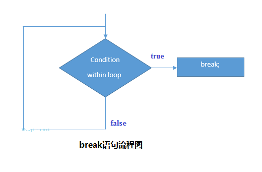

# PHP break语句

PHP **break语句**中断了当前`for`，`while`，`do-while`，`switch`和`for-each`循环的执行。 如果在内循环中使用`break`，它只中断了内循环的执行。

**语法**

```php
jump statement;  
break
```

**break语句流程图如下** 



## PHP Break：内循环

下面来看看一个简单的例子，如果`i`的值等于`5`，则使用**break语句**来中断for循环的执行。

文件名:loopcontrol-break.php

```php
<?php  
    for($i=1;$i<=10;$i++){  
        echo "$i <br/>";  
        if($i==5){  
            break;  
        }  
    }  
?>
```

```bash
php /share/lesson/php/loopcontrol-break.php
```

URL预览:`{url}/loopcontrol-break.php`

## PHP Break：内部循环

PHP **break语句**只中断内循环的执行。

文件名:loopcontrol-innerbreak.php

```php
<?php  
    for($i=1;$i<=3;$i++){  
        for($j=1;$j<=3;$j++){  
            echo "$i   $j<br/>";  
            if($i==2 && $j==2){  
                break;  
            }  
        }  
    }  
?>
```

```bash
php /share/lesson/php/loopcontrol-innerbreak.php
```

URL预览:`{url}/loopcontrol-innerbreak.php

## PHP Break：内部switch语句

文件名:loopcontrol-switchcase.php

PHP **break语句**也用于中断switch case的执行流程。

```php
<?php      
    $num=200;      
    switch($num){      
        case 100:      
            echo("number is equals to 100");      
            break;      
        case 200:      
            echo("number is equal to 200");      
            break;      
        case 50:      
            echo("number is equal to 300");      
            break;      
        default:      
            echo("number is not equal to 100, 200 or 500");      
    }     
?>
```

```bash
php /share/lesson/php/loopcontrol-switchcase.php
```

URL预览:`{url}/loopcontrol-switchcase.php`