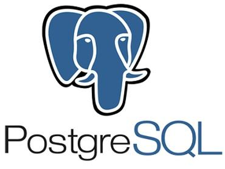

# PostgreSQL 简介

PostgreSQL是一种特性非常齐全的自由软件的对象-关系型数据库管理系统（ORDBMS），是以加州大学计算机系开发的POSTGRES，4.2版本为基础的对象关系型数据库管理系统。POSTGRES的许多领先概念只是在比较迟的时候才出现在商业网站数据库中。

PostgreSQL支持大部分的SQL标准并且提供了很多其他现代特性，如复杂查询、外键、触发器、视图、事务完整性、多版本并发控制等。

同样，PostgreSQL也可以用许多方法扩展，例如通过增加新的数据类型、函数、操作符、聚集函数、索引方法、过程语言等。另外，因为许可证的灵活，任何人都可以以任何目的免费使用、修改和分发PostgreSQL。

## 主要特点
从基本功能上来看，支持ACID、关联完整性、数据库事务、Unicode多国语言。

表和视图方面，PostgreSQL支持临时表，而物化视图，可以使用PL/pgSQL、PL/Perl、PL/Python或其他过程语言的存储过程和触发器模拟。

索引方面，全面支持R-/R+tree索引、哈希索引、反向索引、部分索引、Expression 索引、GiST、GIN（用来加速全文检索），从8.3版本开始支持位图索引。

其他对象上，支持数据域，支持存储过程、触发器、函数、外部调用、游标7）数据表分区方面，支持4种分区，即范围、哈希、混合、列表。

从事务的支持度上看，对事务的支持与MySQL相比，经历了更为彻底的测试。

My ISAM表处理方式方面，MySQL对于无事务的MyISAM表，采用表锁定，1个长时间运行的查询很可能会阻碍对表的更新，而PostgreSQL不存在这样的问题。

从存储过程上看，PostgreSQL支持存储过程。因为存储过程的存在也避免了在网络上大量原始的SQL语句的传输，这样的优势是显而易见的。

用户定义函数的扩展方面，PostgreSQL可以更方便地使用UDF（用户定义函数）进行扩展。

### PostgreSQL的劣势如下：
最新版本和历史版本不分离存储，导致清理老旧版本时需要做更多的扫描，代价比较大但一般的数据库都有高峰期，如果合理安排VACUUM，这也不是很大的问题，而且在PostgreSQL9.0中VACUUM进一步被加强了。

在PostgreSQL中，由于索引完全没有版本信息，不能实现Coverage index scan，即查询只扫描索引，不能直接从索引中返回所需的属性，还需要访问表，而Oracle与Innodb则可以。

