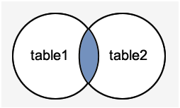

# PostgreSQL 内连接(inner join)

在PostgreSQL中，有以下类型的连接：

- 内连接(INNER JOIN)
- 左外连接(LEFT OUTER JOIN)
- 右外连接(RIGHT OUTER JOIN)
- 全连接(FULL OUTER JOIN)
- 跨连接(CROSS JOIN)

准备数据

 `DEPARTMENT` 

创建另一个表“`DEPARTMENT`”并插入以下值。

```sql
-- Table: public.department

-- DROP TABLE public.department;

CREATE TABLE public.department
(
  id integer,
  dept text,
  fac_id integer
)
WITH (
  OIDS=FALSE
);
ALTER TABLE public.department
  OWNER TO postgres;

-- 插入数据
INSERT INTO department VALUES(1,'IT', 1);
INSERT INTO department VALUES(2,'Engineering', 2);
INSERT INTO department VALUES(3,'HR', 7);
INSERT INTO department VALUES(10,'Market', 10);
```

# PostgreSQL (内连接)INNER JOIN	
PostgreSQL内部连接也被称为连接或简单连接。 这是最常见的连接类型。 此连接返回满足连接条件的多个表中的所有行。

[准备环境及数据](./setup.html)

如下图表示 -


**语法：**

```sql
SELECT table1.columns, table2.columns  
FROM table1  
INNER JOIN table2  
ON table1.common_filed = table2.common_field;
```

**表2：** DEPARTMENT有以下数据 - 

创建另一个表“`DEPARTMENT`”并插入以下值。

```sql
-- Table: public.department

-- DROP TABLE public.department;

CREATE TABLE public.department
(
  id integer,
  dept text,
  fac_id integer
)
WITH (
  OIDS=FALSE
);
ALTER TABLE public.department
  OWNER TO postgres;

-- 插入数据
INSERT INTO department VALUES(1,'IT', 1);
INSERT INTO department VALUES(2,'Engineering', 2);
INSERT INTO department VALUES(3,'HR', 7);
```

执行以下查询内连接两个表：

```sql
SELECT EMPLOYEES.ID, EMPLOYEES.NAME, DEPARTMENT.DEPT  
FROM EMPLOYEES   
INNER JOIN DEPARTMENT  
ON EMPLOYEES.ID = DEPARTMENT.ID;
```
