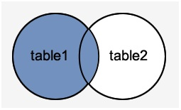
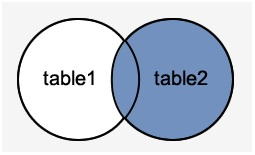
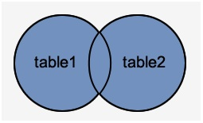

# PostgreSQL 外连接(outter join)

外连接是内联的延伸，外连接有三种类型。它们分别如下 -

- 左外连接
- 右外连接
- 全外连接

## 左外连接

左外连接返回从“`ON`”条件中指定的左侧表中的所有行，只返回满足条件的另一个表中的行。
如下图中所表示：


**语法：**

```sql
SELECT table1.columns, table2.columns  
FROM table1  
LEFT OUTER JOIN table2  
ON table1.common_filed = table2.common_field;
```

**示例1**

[准备环境及数据](./setup.html)

执行以下左连接查询：

```sql
SELECT EMPLOYEES.ID, EMPLOYEES.NAME, DEPARTMENT.DEPT  
FROM EMPLOYEES 
LEFT OUTER JOIN DEPARTMENT  
ON EMPLOYEES.ID = DEPARTMENT.ID;
```

从上面图中可以看到，左表(`EMPLOYEES`)全部列出来，而右表(`DEPARTMENT`)没有匹配上的项全留为空值。

## 右外连接

右外连接返回从“`ON`”条件中指定的右侧表中的所有行，只返回满足条件的另一个表中的行。
如下图中所表示：

**语法：**

```sql
SELECT table1.columns, table2.columns  
FROM table1  
RIGHT OUTER JOIN table2  
ON table1.common_filed = table2.common_field;
```

如下图所示(蓝色部分)


**示例**

执行以下左连接查询：

```sql
SELECT EMPLOYEES.ID, EMPLOYEES.NAME, DEPARTMENT.DEPT  
FROM EMPLOYEES 
RIGHT OUTER JOIN DEPARTMENT  
ON EMPLOYEES.ID = DEPARTMENT.ID;
```

从上面图中可以看到，右表(`DEPARTMENT`)全部列出来，而左表(`EMPLOYEES`)没有匹配上的项全留为空值。

## PostgreSQL全外连接 			

全外连接从左表和左表中返回所有行。 它将`NULL`置于不满足连接条件的位置。

**语法：**

```sql
SELECT table1.columns, table2.columns  
FROM table1  
FULL OUTER JOIN table2  
ON table1.common_filed = table2.common_field;
```

如下图所示(蓝色部分) - 



**示例**

执行以下左连接查询：

```sql
SELECT EMPLOYEES.ID, EMPLOYEES.NAME, DEPARTMENT.DEPT  
FROM EMPLOYEES 
FULL OUTER JOIN DEPARTMENT  
ON EMPLOYEES.ID = DEPARTMENT.ID;
```

从上面图中可以看到，左表(`EMPLOYEES`)和右表(`DEPARTMENT`)没有匹配上的项全留为空值。