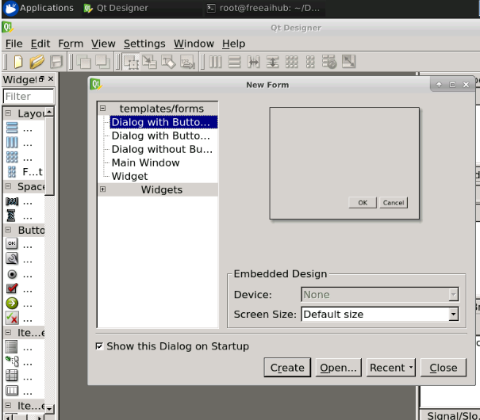

# PyQt 使用Qt Designer

PyQt安装程序带有一个名为**Qt Designer**的GUI构建器工具。使用其简单的拖放界面，无需编写代码即可快速构建GUI界面。但是，它不是Visual Studio之类的IDE。因此，Qt Designer无法调试和构建应用程序。

## 如何打开Qt Designer

在右侧实验区VNC桌面环境下，打开一个终端，输入`designer`即可打开Qt Designer

```bash
designer
```

## 如何使用Qt Designer

<iframe src="//player.bilibili.com/player.html?aid=90474061&bvid=BV1P7411w7UF&cid=154511288&page=1" scrolling="no" border="0" frameborder="no" framespacing="0" allowfullscreen="true" width="100%" height="460"> </iframe>
设计的表单另存为demo.ui。该ui文件包含设计中的小部件及其属性的XML表示形式。通过使用pyuic4命令行实用程序，可以将该设计转换为Python等效项。该实用程序是uic模块的包装器。

pyuic4的用法如下- 

```bash
pyuic4 demo.ui –o demo.py –x
```

