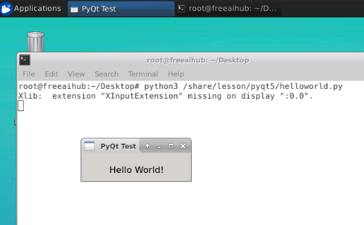

# PyQt 环境安装及配置

## 本课程在线环境的安装

### 打开终端

在右侧桌面环境空白处，右键打开`Open Terminal Here`

### 安装PyQt4环境
```shell
#先更新apt安装源
apt update

#安装PyQt4环境
apt install python3-pyqt4 -y

#补充PyQt4.QtSQL包
apt install python3-pyqt4.qtsql -y

#mysql,sqlite驱动 
apt install libqt4-sql-mysql libqt4-sql-sqlite -y 

#安装PyQt4 Designer
apt install qt4-designer -y
```

### 验证环境

在右侧的实验区，打开一个终端，运行试试

```bash
python3 /share/lesson/pyqt5/helloworld.py
```

