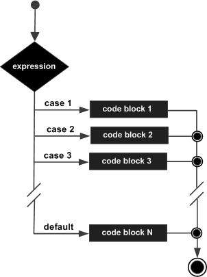

# R语言 逻辑判断(logic)
决策结构要求程序员指定要由程序评估或测试的一个或多个条件，以及如果条件被确定为真则要执行的一个或多个语句，如果条件为假则执行其他语句。

R提供以下类型的决策语句。 单击以下链接以检查其详细信息。

| 声明 | 描述                                                   |
| ------ | :----------------------------------------------------------- |
|`if`语句   | `if`语句由一个布尔表达式后跟一个或多个语句组成。 |
|`if ... else`语句      | `if`语句后面可以有一个可选的`else`语句，当布尔表达式为false时执行。 |
| `switch`语句    |`switch`语句允许根据值列表测试变量的相等性。 |

## `if`语句
`if`由一个布尔表达式后跟一个或多个语句组成。

### 语法
在R中创建`if`语句的基本语法是：
```
if(boolean_expression) {
   // statement(s) will execute if the boolean expression is true.
}
```
如果布尔表达式的计算结果为true，那么`if`语句中的代码块将被执行。 如果布尔表达式的计算结果为false，那么第一组代码在`if`语句结束之后（在结束大括号之后）将被执行。
#### 练习：
```R
x <- 30L
if(is.integer(x))
{
   print("X is an Integer")
}
```
# `if...else`语句

if语句后面可以是一个可选的`else`语句，当布尔表达式为false时执行。
## 语法

在R中创建`if ... else`语句的基本语法是:
```
if(boolean_expression) {
   // statement(s) will execute if the boolean expression is true.
} else {
   // statement(s) will execute if the boolean expression is false.
}
```
如果布尔表达式的计算结果为真，则将执行if代码块，否则将执行代码块。

### 流程图


#### 练习
```R
x <- c("what","is","truth")

if("Truth" %in% x) {
   print("Truth is found")
} else {
   print("Truth is not found")
}
```
这里“Truth”和“truth”是两个不同的字符串。

## `if ... else if ... else`语句
`if`语句后面可以跟一个可选的`else if ... else`语句，这对于使用single`if ... else if`语句测试各种条件非常有用。

当使用`if，else if，else`语句有几点要记住。
- 如果可以有零或一个`else`，它必须在任何其他if之后。
- 一个`i`f可以有0到许多`else if`和它们必须在`else`之前。
- 一旦一个`else`如果成功，没有任何剩余的`else if`或`els`e将被测试。

### 语法

在R中创建`if ... else if ... else`语句的基本语法是
```
if(boolean_expression 1) {
   // Executes when the boolean expression 1 is true.
} else if( boolean_expression 2) {
   // Executes when the boolean expression 2 is true.
} else if( boolean_expression 3) {
   // Executes when the boolean expression 3 is true.
} else {
   // executes when none of the above condition is true.
}
```

#### 练习：

```R
x <- c("what","is","truth")

if("Truth" %in% x) {
   print("Truth is found the first time")
} else if ("truth" %in% x) {
   print("truth is found the second time")
} else {
   print("No truth found")
}
```

## `switch`语句

`switch`语句允许根据值列表测试变量的相等性。 每个值都称为大小写，并且针对每种情况检查打开的变量。

### 语法

在R中创建switch语句的基本语法是 -`switch(expression, case1, case2, case3....)`

以下规则适用于`switch`语句：

- 如果`expression`的值不是字符串，那么它被强制为整数。
- 在交换机中可以有任意数量的`case`语句。 每个案例后面都跟要比较的值和冒号。
- 如果整数的值在1和nargs() - 1（参数的最大数目）之间，则对case条件的相应元素求值并返回结果。
- 如果表达式求值为字符串，那么该字符串与元素的名称匹配。
- 如果有多个匹配，则返回第一个匹配元素。
- 无默认参数可用。
- 在没有匹配的情况下，如果有一个未命名的元素...它的值被返回。 （如果有多个这样的参数，则返回错误。）

### 流程图



#### 练习：switch
```R
x <- switch(3,   "first",   "second",   "third",   "fourth" ) 
print(x)
```
当上面的代码被编译和执行时，它产生以下结果 `[1] "third"`