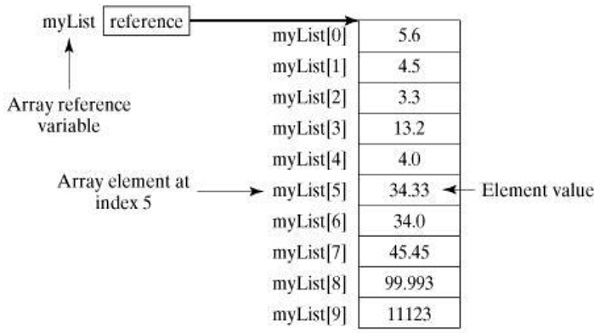

# Scala 数组(array)

Scala提供了一种数据结构叫作数组，数组是一种存储了相同类型元素的固定大小顺序集合。数组用于存储数据集合，但将数组视为相同类型变量的集合通常更为有用。

可以声明一个数组变量，例如:`numbers`，使用`numbers[0]`，`numbers[1]`和`...`，`numbers[99]`来表示单个变量，而不是分别地声明每个变量，例如`number0`，`number1`，`...`等变量。 本教程介绍如何使用索引变量声明数组变量，创建数组和使用数组。数组的第一个元素的索引是数字`0`，最后一个元素的索引是元素的总数减去`1`。

## 声明数组变量

要在程序中使用数组，必须先声明一个变量来引用数组，并且必须指定变量可引用的数组类型。

以下是声明数组变量的语法。

**语法**

```scala
var z:Array[String] = new Array[String](3)

// 或者

var z = new Array[String](3)
```

这里，变量`z`被声明为可以容纳三个元素的字符串数组。可以将值分配给单个元素或访问每个元素，访问元素通过使用如下命令来完成：

```scala
z(0) = "Zara"; z(1) = "Nuha"; z(4/2) = "Ayan"
```

一般来说，索引可以是产生整数的任何表达式。还有一种定义数组的方法 -

```scala
var z = Array("Maxsu", "Nancy", "Alen")
```

以下图片表示一个名称为：`myList`的数组。 这里，`myList`保存十个双精度(`double`)值，索引为`0`到`9`。



## 处理处理

当处理数组元素时，我们经常使用循环控制结构，因为数组中的所有元素都是相同的类型，数组的大小是已知的。

下面是一个示例程序，演示如何创建，初始化和处理数组 -

**示例**

文件名:Array1.scala

```scala
object Array1 {
   def main(args: Array[String]) {
      var myList = Array(1.9, 2.9, 3.4, 3.5)

      // Print all the array elements
      for ( x <- myList ) {
         println( x )
      }

      // Summing all elements
      var total = 0.0;

      for ( i <- 0 to (myList.length - 1)) {
         total += myList(i);
      }
      println("Total is " + total);

      // Finding the largest element
      var max = myList(0);

      for ( i <- 1 to (myList.length - 1) ) {
         if (myList(i) > max) max = myList(i);
      }

      println("Max is " + max);
   }
}
```

```bash
scala /share/lesson/scala/Array1.scala
```

康康

Scala不直接支持各种数组操作，它提供各种方法来处理任何维度的数组。 如果要使用不同的方法，则需要导入`Array._`包。

## 多维数组

在许多情况下，需要定义和使用多维数组(即数组的数组)。 例如，矩阵和表是可以被实现为二维数组结构的例子。

以下是定义二维数组的示例 -

```scala
var myMatrix = ofDim[Int](3,3)
```

这是一个具有三个元素的数组，每个元素都是一个具有三个元素的整数数组。

尝试以下示例程序来处理多维数组

文件名:Array2.scala

```scala
import Array._

object Array2 {
   def main(args: Array[String]) {
      var myMatrix = ofDim[Int](3,3)

      // build a matrix
      for (i <- 0 to 2) {
         for ( j <- 0 to 2) {
            myMatrix(i)(j) = j;
         }
      }

      // Print two dimensional array
      for (i <- 0 to 2) {
         for ( j <- 0 to 2) {
            print(" " + myMatrix(i)(j));
         }
         println();
      }
   }
}
```

```bash
scala /share/lesson/scala/Array2.scala
```

康康

## 连接阵列

尝试使用`concat()`方法连接两个数组的以下示例。可以将多个数组作为参数传递给`concat()`方法。

文件名:Array3.scala

```scala
import Array._

object Array3 {
   def main(args: Array[String]) {
      var myList1 = Array(1.9, 2.9, 3.4, 3.5)
      var myList2 = Array(8.9, 7.9, 0.4, 1.5)

      var myList3 =  concat( myList1, myList2)

      // Print all the array elements
      for ( x <- myList3 ) {
         println( x )
      }
   }
}
```

使用以下命令编译和执行此程序。

```shell
scala /share/lesson/scala/Array3.scala
```

## 使用范围创建数组

使用`range()`方法来生成包含给定范围内增加整数序列的数组。 您可以使用`final`参数作为步差来创建序列; 如果不使用`final`参数，则步差将被假定为`1`。

让我们举个例子来创建一个范围`(10,20,2)`的数组：创建一个数组，其元素介于`10`和`20`之间，范围步差为`2`，数组中的元素是：`10`,`12`,`14`,`16`和`18`。

另一个例子：`range(10，20)`。 这里的范围不同，默认情况下它假定为`1`个元素。 它创建一个数组，其元素介于`10`和`20`之间，范围步差为`1`。数组中的元素为：`10`,`11`,`12`,`13`，`...`和`19`。

以下示例程序显示如何使用范围创建数组。

**示例**

文件名:Array4.scala

```scala
import Array._

object Demo {
   def main(args: Array[String]) {
      var myList1 = range(10, 20, 2)
      var myList2 = range(10,20)

      // Print all the array elements
      for ( x <- myList1 ) {
         print( " " + x )
      }

      println()
      for ( x <- myList2 ) {
         print( " " + x )
      }
   }
}
```

使用以下命令编译和执行此程序。

```shell
scala /share/lesson/scala/Array4.scala
```

## Scala数组方法

以下是使用数组时可以使用的重要方法。 如上所示，必须在使用任何上述方法之前导入`Array._`包。 有关可用方法的完整列表，请查看Scala的官方文档。

| 序号 | 方法                                                         | 说明                                                         |
| ---- | ------------------------------------------------------------ | ------------------------------------------------------------ |
| 1    | `def apply( x: T, xs: T* ): Array[T]`                        | 创建一个`T`对象数组，其中`T`可以是：`Unit`，`Double`，`Float`，`Long`，`Int`，`Char`，`Short`，`Byte`，`Boolean`。 |
| 2    | `def concat[T]( xss: Array[T]* ): Array[T]`                  | 将所有数组连接成一个数组。                                   |
| 3    | `def copy( src: AnyRef, srcPos: Int, dest: AnyRef, destPos: Int, length: Int ): Unit` | 将一个数组复制到另一个。 相当于Java的`System.arraycopy(src，srcPos，dest，destPos，length)`。 |
| 4    | `def empty[T]: Array[T]`                                     | 返回长度为`0`的数组                                          |
| 5    | `def iterate[T]( start: T, len: Int )( f: (T) => T ): Array[T]` | 返回一个包含函数的重复应用程序到一个起始值的数组。           |
| 6    | `def fill[T]( n: Int )(elem: => T): Array[T]`                | 返回一个包含某些元素计算结果的数组。                         |
| 7    | `def fill[T]( n1: Int, n2: Int )( elem: => T ): Array[Array[T]]` | 返回一个包含一些元素计算结果的二维数组。                     |
| 8    | `def iterate[T]( start: T, len: Int)( f: (T) => T ): Array[T]` | 返回一个包含一个函数的重复应用程序到一个起始值的数组。       |
| 9    | `def ofDim[T]( n1: Int ): Array[T]`                          | 创建具有给定维度的数组。                                     |
| 10   | `def ofDim[T]( n1: Int, n2: Int ): Array[Array[T]]`          | 创建一个二维数组                                             |
| 11   | `def ofDim[T]( n1: Int, n2: Int, n3: Int ): Array[Array[Array[T]]]` | 创建一个`3`维数组                                            |
| 12   | `def range( start: Int, end: Int, step: Int ): Array[Int]`   | 返回一个整数间隔中包含相等间隔值的数组。                     |
| 13   | `def range( start: Int, end: Int ): Array[Int]`              | 返回一个包含一个范围内增加整数序列的数组。                   |
| 14   | `def tabulate[T]( n: Int )(f: (Int)=> T): Array[T]`          | 从`0`开始的整数值范围内，返回一个包含给定函数值的数组。      |
| 15   | `def tabulate[T]( n1: Int, n2: Int )( f: (Int, Int ) => T): Array[Array[T]]` | 返回一个二维数组，其中包含从`0`开始的整数值范围内给定函数的值。 |