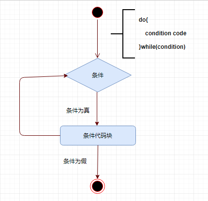

# Scala do...while循环

## 语法

以下是`do...while`循环的语法。

```scala
do {
   statement(s);
} while( condition );
```

请注意，条件(`condition`)表达式出现在循环的末尾，因此循环中的语句在测试条件之前执行一次。 如果条件为真，则控制流程跳回来执行，并且循环中的语句再次执行。 该过程重复，直到给定条件变为假。

**流程图**



尝试以下示例程序来了解Scala编程语言中的`do...while`循环控制语句。

文件名:loopDoWhile.scala

```scala
object loopDoWhile {
   def main(args: Array[String]) {
      // Local variable declaration:
      var a = 10;

      // do loop execution
      do {
         println( "Value of a: " + a );
         a = a + 1;
      }
      while( a < 20 )
   }
}
```

使用以下命令编译和执行此程序。

```shell
scala /share/lesson/scala/loopWhile.scala
```