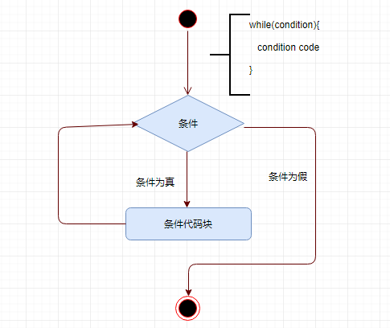

# Scala while循环

当给定条件为真时，`while`循环重复一个语句或一组语句。它在执行循环体之前测试条件状态。 只要给定的条件为真，`while`循环语句重复执行目标语句。

**语法**

以下是`while`循环的语法 - 

```scala
while(condition){
   statement(s);
}
```

在这里，语句(`statement(s)`)可能是一个单一语句或一个语句块。条件(`condition`)可以是任何表达式，`true`是任何非零值。循环在条件为真时循环。当条件(`condition`)变为`false`时，程序控制传递到循环之后的行代码。



在这里，`while`循环的关键是循环体可能不会运行。因为当条件被测试并且结果为假时，循环体将被跳过，这时`while`循环之后的第一个语句将被执行。

尝试以下示例程序来了解Scala编程语言中的`while`循环控制语句。

文件名:loopWhile.scala

```scala
object loopWhile {
   def main(args: Array[String]) {
      // Local variable declaration:
      var a = 10;

      // while loop execution
      while( a < 20 ){
         println( "Value of a: " + a );
         a = a + 1;
      }
   }
}
```

使用以下命令编译和执行此程序。

```shell
scala /share/lesson/scala/loopWhile.scala
```