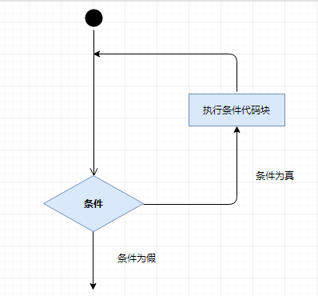

# Scala 循环语句

本章将介绍Scala编程语言中的循环控制结构。

可能会有一种情况，当你需要执行一段代码多次。 一般来说，语句依次执行：函数中的第一个语句先执行，后跟第二个语句，依此类推。

编程语言提供了允许更复杂的执行路径的各种控制结构。

循环语句允许我们多次执行一个语句或一组语句，以下是大多数编程语言中循环语句的一般形式 -



Scala编程语言提供以下类型的循环来处理循环需求。 单击以下表中的链接来查看其详细信息。

| 序号 | 循环类型                                                     | 描述                                                         |
| ---- | ------------------------------------------------------------ | ------------------------------------------------------------ |
| 1    | [while循环](./loop-while.html) | 在给定条件为真时，重复执行一个语句或一组语句。它在执行循环体之前测试条件。 |
| 2    | [do…while循环](./loop-do-while.html) | 像`while`语句一样，除了它循环体结尾测试条件。                |
| 3    | [for循环](./loop-for.html)   | 多次执行一系列语句，并缩写管理循环变量的代码。               |

## 循环控制语句

循环控制语句从其正常顺序更改执行。当执行离开范围时，在该范围内创建的所有自动对象都将被销毁。Scala不支持像Java那样的`break`或`continue`语句，但是从*Scala 2.8*版本开始，加入了一种打断循环的方法。点击以下链接查看详细信息。

| 序号 | 循环类型                                                     | 描述                                       |
| ---- | ------------------------------------------------------------ | ------------------------------------------ |
| 1    | [break语句](./loopcontrol-break.html) | 终止循环语句并将执行转移到循环之后的语句。 |

## 无限循环

如果一个条件永远不会变成`false`，循环将成为一个无限循环。 如果您使用Scala，`while`循环是实现无限循环的最佳方法。

以下程序实现无限循环 - 

```scala
object Demo {
   def main(args: Array[String]) {
      var a = 10;

      // An infinite loop.
      while( true ){
         println( "Value of a: " + a );
      }
   }
}
```