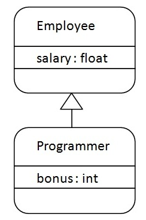
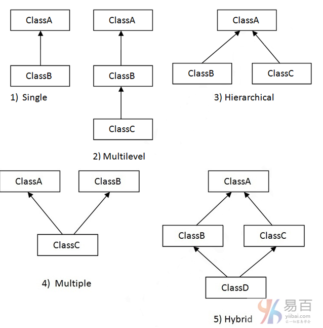

# Scala 继承(inheritance)

继承是面向对象的概念，用于代码的可重用性。可以通过使用`extends`关键字来实现继承。 为了实现继承，一个类必须扩展到其他类，被扩展类称为超类或父类。扩展的类称为派生类或子类。

**示例**

```scala
class SubClassName extends SuperClassName(){  
    /* Write your code  
     *  methods and fields etc. 
     */  
 }
```

## 继承的简单例子



**Scala单继承示例**

文件名:oobInheritance.scala

```scala
class Employee{  
    var salary:Float = 11100  
}  

class Programmer extends Employee{  
    var bonus:Int = 5100  
    println("Salary = "+salary)  
    println("Bonus = "+bonus)  
}  

object oobInheritance{  
    def main(args:Array[String]){  
        new Programmer()  
    }  
}
```

用于以下命令编译和执行这两个程序，输出结果如下 - 

```bash
scala /share/lesson/scala/oobInheritance.scala
```

## Scala继承类型

Scala支持各种类型的继承，包括单一，多层次，多重和混合。可以在类中使用单一，多层次和层次结构。多重和混合只能通过使用特征来实现。在这里，通过使用图形表示所有类型的继承。



文件名:oobInheritanceType.scala

```scala
class A{  
    var salary1 = 10000  
}  

class B extends A{  
    var salary2 = 20000  
}  

class C extends B{  
    def show(){  
        println("salary1 = "+salary1)  
        println("salary2 = "+salary2)  
    }  
}  

object oobInheritanceType{  
    def main(args:Array[String]){
        var c = new C()  
        c.show()  

    }  
}
```

用于以下命令编译和执行这两个程序，输出结果如下 - 

```bash
scala /share/lesson/scala/oobInheritanceType.scala
```