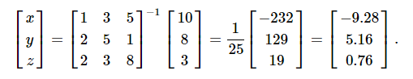

# Scipy 线性代数(Linalg)

SciPy是使用优化的ATLAS LAPACK和BLAS库构建的。 它具有非常快的线性代数能力。 所有这些线性代数例程都需要一个可以转换为二维数组的对象。 这些例程的输出也是一个二维数组。

**SciPy.linalg与NumPy.linalg**

`scipy.linalg`包含`numpy.linalg`中的所有函数。 另外，`scipy.linalg`还有一些不在`numpy.linalg`中的高级函数。 在`numpy.linalg`上使用`scipy.linalg`的另一个优点是它总是用`BLAS/LAPACK`支持编译，而对于NumPy，这是可选的。 因此，根据NumPy的安装方式，SciPy版本可能会更快。

## 线性方程组

`scipy.linalg.solve`特征为未知的`x`，`y`值求解线性方程`a * x + b * y = Z`。

作为一个例子，假设需要解下面的联立方程。


要求解`x`，`y`，`z`值的上述方程式，可以使用矩阵求逆来求解向量，如下所示。


但是，最好使用`linalg.solve`命令，该命令可以更快，更稳定。

求解函数采用两个输入`'a'`和`'b'`，其中`'a'`表示系数，`'b'`表示相应的右侧值并返回解矩阵。

现在来看看下面的例子。

```python
#importing the scipy and numpy packages
from scipy import linalg
import numpy as np

#Declaring the numpy arrays
a = np.array([[3, 2, 0], [1, -1, 0], [0, 5, 1]])
b = np.array([2, 4, -1])

#Passing the values to the solve function
x = linalg.solve(a, b)

#printing the result array
print(x)
```

## 查找一个行列式

方阵A的行列式通常表示为`| A |`并且是线性代数中经常使用的量。 在SciPy中，这是使用`det()`函数计算的。 它将矩阵作为输入并返回一个标量值。

下面来看看一个例子。

```python
#importing the scipy and numpy packages
from scipy import linalg
import numpy as np

#Declaring the numpy array
A = np.array([[1,2],[3,4]])

#Passing the values to the det function
x = linalg.det(A)

#printing the result
print(x)
```

## 特征值和特征向量

特征值 - 特征向量问题是最常用的线性代数运算之一。 我们可以通过考虑以下关系式来找到方阵(A)的特征值(λ)和相应的特征向量(v)

```
Av = λv
```

`scipy.linalg.eig`从普通或广义特征值问题计算特征值。 该函数返回特征值和特征向量。

让我们来看看下面的例子。

```python
#importing the scipy and numpy packages
from scipy import linalg
import numpy as np

#Declaring the numpy array
A = np.array([[1,2],[3,4]])

#Passing the values to the eig function
l, v = linalg.eig(A)

#printing the result for eigen values
print(l)

#printing the result for eigen vectors
print(v)
```

## 奇异值分解

奇异值分解(SVD)可以被认为是特征值问题扩展到非矩阵的矩阵。

`scipy.linalg.svd`将矩阵`'a'`分解为两个酉矩阵`'U'`和`'Vh'`，以及一个奇异值(实数，非负)的一维数组`'s'`，使得`a == U * S * Vh`，其中`'S'`是具有主对角线`'s'`的适当形状的零点矩阵。

让我们来看看下面的例子。参考以下代码 - 

```python
#importing the scipy and numpy packages
from scipy import linalg
import numpy as np

#Declaring the numpy array
a = np.random.randn(3, 2) + 1.j*np.random.randn(3, 2)

#Passing the values to the eig function
U, s, Vh = linalg.svd(a)

# printing the result
print(U, Vh, s)
```
<code class=gatsby-kernelname data-language=python></code>
