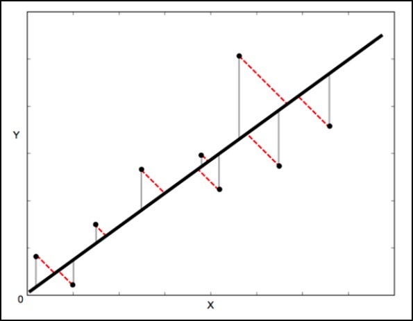

# Scipy  正交距离回归(ODR)

ODR代表正交距离回归，用于回归研究。 基本线性回归通常用于通过在图上绘制最佳拟合线来估计两个变量`y`和`x`之间的关系。

用于此的数学方法称为最小平方，旨在最小化每个点的平方误差总和。 这里的关键问题是如何计算每个点的误差(也称为残差)？

在一个标准的线性回归中，目的是从`X`值预测`Y`值 - 因此明智的做法是计算`Y`值的误差(如下图所示的灰线所示)。 但是，有时考虑`X`和`Y`的误差(如下图中的红色虚线所示)更为明智。

例如 - 当知道对`X`的测量是不确定的，或者当不想关注一个变量相对于另一个变量的错误时。


正交距离回归(ODR)是一种可以做到这一点的方法(正交在这里表示为垂直 - 所以它计算垂直于线的误差，而不仅仅是’垂直’)。

**单变量回归的scipy.odr实现**

以下示例演示单变量回归的`scipy.odr`实现。

```python
%matplotlib inline
import numpy as np
import matplotlib.pyplot as plt
from scipy.odr import *
import random

# Initiate some data, giving some randomness using random.random().
x = np.array([0, 1, 2, 3, 4, 5])
y = np.array([i**2 + random.random() for i in x])

# Define a function (quadratic in our case) to fit the data with.
def linear_func(p, x):
   m, c = p
   return m*x + c

# Create a model for fitting.
linear_model = Model(linear_func)

# Create a RealData object using our initiated data from above.
data = RealData(x, y)

# Set up ODR with the model and data.
odr = ODR(data, linear_model, beta0=[0., 1.])

# Run the regression.
out = odr.run()

# Use the in-built pprint method to give us results.
out.pprint()
```
<code class=gatsby-kernelname data-language=python></code>
