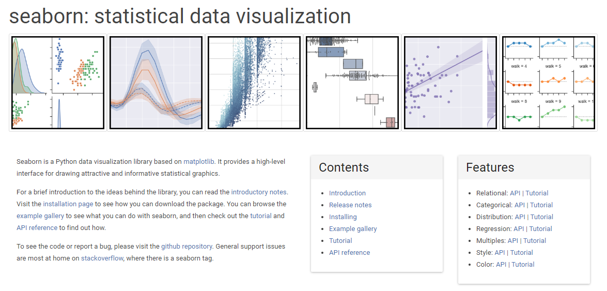

# Seaborn 简介

Seaborn是BSD许可的开源Python库，提供了高级API，可使用Python编程语言来可视化数据。

## Seaborn与Matplotlib

总结说，如果Matplotlib“尝试使容易的事情变得容易而使困难的事情变得可能”，Seaborn也会尝试使一组定义明确的困难的事情也变得容易。

Seaborn帮助解决Matplotlib面临的两个主要问题。问题是-

- 默认Matplotlib参数
- 使用数据框

随着Seaborn对Matplotlib的补充和扩展，学习曲线是渐进的。如果您了解Matplotlib，那么您已经完成了Seaborn的一半。

### Seaborn的重要特征

Seaborn建立在Python的核心可视化库Matplotlib之上。它旨在作为补充，而不是替代。但是，Seaborn具有一些非常重要的功能。让我们在这里看到其中的一些。功能帮助-

- 内置主题以设置Matplotlib图形样式
- 可视化单变量和双变量数据
- 拟合并可视化线性回归模型
- 绘制统计时间序列数据
- Seaborn适用于NumPy和Pandas数据结构
- 它带有用于为Matplotlib图形设计样式的内置主题

在大多数情况下，您仍将使用Matplotlib进行简单绘图。建议您了解Matplotlib的知识，以调整Seaborn的默认图。
<code class=gatsby-kernelname data-language=python></code>
