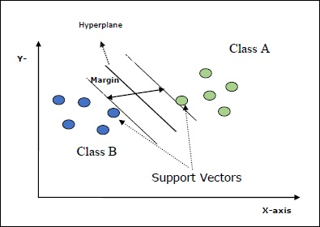

# sklearn 支持向量机(SVM)

本章介绍了一种称为支持向量机（SVM）的机器学习方法。

## 介绍

支持向量机（SVM）是强大而灵活的监督型机器学习方法，用于分类，回归和离群值检测。SVM在高维空间中非常有效，通常用于分类问题。SVM受欢迎且具有存储效率，因为它们在决策函数中使用训练点的子集。

SVM的主要目标是将数据集分为几类，以找到**最大的边际超平面（MMH）**，可以通过以下两个步骤完成-

- 支持向量机将首先以迭代方式生成超平面，从而以最佳方式将类分离。
- 之后，它将选择正确隔离类的超平面。

SVM中的一些重要概念如下-

- **支持向量** -它们可以定义为最接近超平面的数据点。支持向量有助于确定分隔线。
- **超平面** -划分具有不同类别的对象集的决策平面或空间。
- **裕度** -不同类别的壁橱数据点上两条线之间的间隙称为裕度。

下图将为您提供有关这些SVM概念的见解-



Scikit-learn中的SVM支持稀疏和密集样本矢量作为输入。

## 支持向量机的分类

Scikit-learn提供三个类，即**SVC，NuSVC**和**LinearSVC**，它们可以执行多类分类。

## SVC

这是C支持向量分类，其实现基于**libsvm**。scikit-learn使用的模块是**sklearn.svm.SVC**。此类根据一对一方案处理多类支持。

**实施实例**

像其他分类器一样，SVC还必须配备以下两个数组-

- 存放训练样本的数组**X。**它的大小为[n_samples，n_features]。
- 保存目标值的数组**Y**，即训练样本的类别标签。它的大小为[n_samples]。

以下Python脚本使用**sklearn.svm.SVC**类-

```python
import numpy as np
X = np.array([[-1, -1], [-2, -1], [1, 1], [2, 1]])
y = np.array([1, 1, 2, 2])
from sklearn.svm import SVC
SVCClf = SVC(kernel = 'linear',gamma = 'scale', shrinking = False,)
SVCClf.fit(X, y)
```


现在，一旦拟合，我们就可以在以下python脚本的帮助下获得权重向量-

```python
SVCClf.coef_
```

类似地，我们可以获取其他属性的值，如下所示：

```python
SVCClf.predict([[-0.5,-0.8]])
```

```python
SVCClf.n_support_
```

```python
SVCClf.support_vectors_
```

```python
SVCClf.support_
```

```python
SVCClf.intercept_
```

```python
SVCClf.fit_status_
```

## NuSVC

NuSVC是Nu支持向量分类。它是scikit-learn提供的另一个类，可以执行多类分类。就像SVC一样，但是NuSVC接受略有不同的参数集。与SVC不同的参数如下-

- **nu-**浮动，可选，默认= 0.5

它代表训练误差分数的上限和支持向量分数的下限。其值应在（o，1]的间隔内。

其余参数和属性与SVC相同。

### 实例

我们也可以使用**sklearn.svm.NuSVC**类实现相同的示例。

```python
import numpy as np
X = np.array([[-1, -1], [-2, -1], [1, 1], [2, 1]])
y = np.array([1, 1, 2, 2])
from sklearn.svm import NuSVC
NuSVCClf = NuSVC(kernel = 'linear',gamma = 'scale', shrinking = False,)
NuSVCClf.fit(X, y)
```

我们可以像SVC一样获得其余属性的输出。

## 线性SVC

这是线性支持向量分类。它类似于具有内核=“线性”的SVC。它们之间的区别在于**LinearSVC**是根据**liblinear**实现的，而SVC是在**libsvm中**实现的。这就是**LinearSVC**在罚分和损失函数选择方面更具灵活性的原因。它还可以更好地扩展到大量样本。

如果我们谈论它的参数和属性，那么它就不支持**“内核”，**因为它被认为是线性的，并且还缺少一些属性，例如**support_，support_vectors_，n_support_，fit_status_**和**dual_coef_**。

但是，它支持**惩罚**和**损失**参数，如下所示：

- **惩罚-字符串，L1或L2（默认='L2'）**

  此参数用于指定惩罚（正则化）中使用的标准（L1或L2）。

- **loss-字符串，铰链，squared_hinge（默认值= squared_hinge）**

  它表示损耗函数，其中“铰链”是标准SVM损耗，“ squared_hinge”是铰链损耗的平方。

### 实例

以下Python脚本使用**sklearn.svm.LinearSVC**类-

```python
from sklearn.svm import LinearSVC
from sklearn.datasets import make_classification
X, y = make_classification(n_features = 4, random_state = 0)
LSVCClf = LinearSVC(dual = False, random_state = 0, penalty = 'l1',tol = 1e-5)
LSVCClf.fit(X, y)
```

现在，一旦拟合，模型可以预测新值，如下所示：

```python
LSVCClf.predict([[0,0,0,0]])
```

对于上面的示例，我们可以借助以下python脚本获取权重向量-

```python
LSVCClf.coef_
```

同样，我们可以在以下python脚本的帮助下获取拦截的值-

```python
LSVCClf.intercept_
```


## 支持向量机回归

如前所述，SVM用于分类和回归问题。Scikit-learn的支持向量分类（SVC）方法也可以扩展来解决回归问题。该扩展方法称为支持向量回归（SVR）。

### SVM和SVR之间的基本相似之处

SVC创建的模型仅取决于训练数据的子集。为什么？因为用于构建模型的成本函数并不关心位于边界之外的训练数据点。

而SVR（支持向量回归）产生的模型也仅取决于训练数据的子集。为什么？因为用于构建模型的成本函数会忽略任何接近模型预测的训练数据点。

Scikit-learn提供了三个类，即**SVR，NuSVR和LinearSVR，**作为SVR的三种不同实现。

## SVR

这是Epsilon支持的向量回归，其实现基于**libsvm**。与**SVC**相反，模型中有两个自由参数，即**'C'**和**'epsilon'**。

- **epsilon-**浮动，可选，默认= 0.1

它代表epsilon-SVR模型中的epsilon，并指定在epsilon-tube中训练损失函数中没有惩罚与实际值之间的距离为epsilon的点。

其余的参数和属性与我们在**SVC中**使用的相似。

### 实例

以下Python脚本使用**sklearn.svm.SVR**类-

```python
from sklearn import svm
X = [[1, 1], [2, 2]]
y = [1, 2]
SVRReg = svm.SVR(kernel = 'linear', gamma = 'auto')
SVRReg.fit(X, y)
```

现在，一旦拟合，我们就可以在以下python脚本的帮助下获得权重向量-

```python
SVRReg.coef_
```

类似地，我们可以获取其他属性的值，如下所示：

```python
SVRReg.predict([[1,1]])
```

同样，我们也可以获取其他属性的值。

## NuSVR

NuSVR是Nu支持向量回归。它类似于NuSVC，但是NuSVR使用参数**nu**来控制支持向量的数量。而且，与NuSVC的**nu**替换了C参数不同，此处它替换了**epsilon**。

### 实例

以下Python脚本使用**sklearn.svm.SVR**类-

```python
from sklearn.svm import NuSVR
import numpy as np
n_samples, n_features = 20, 15
np.random.seed(0)
y = np.random.randn(n_samples)
X = np.random.randn(n_samples, n_features)
NuSVRReg = NuSVR(kernel = 'linear', gamma = 'auto',C = 1.0, nu = 0.1)
NuSVRReg.fit(X, y)
```

现在，一旦拟合，我们就可以在以下python脚本的帮助下获得权重向量-

```python
NuSVRReg.coef_
```


同样，我们也可以获取其他属性的值。

## 线性SVR

它是线性支持向量回归。它类似于具有内核=“线性”的SVR。它们之间的区别是，**LinearSVR**来讲实现**liblinear**，而SVC中实现**LIBSVM**。这就是**LinearSVR**在罚分和损失函数选择方面更具灵活性的原因。它还可以更好地扩展到大量样本。

如果我们谈论它的参数和属性，那么它就不支持**“内核”，**因为它被认为是线性的，并且还缺少一些属性，例如**support_，support_vectors_，n_support_，fit_status_**和**dual_coef_**。

但是，它支持以下“损失”参数-

- **loss-**字符串，可选，默认='epsilon_insensitive'

它表示损失函数，其中epsilon_insensitive损失是L1损失，平方的epsilon_insensitive损失是L2损失。

### 实例

以下Python脚本使用**sklearn.svm.LinearSVR**类-

```python
from sklearn.svm import LinearSVR
from sklearn.datasets import make_regression
X, y = make_regression(n_features = 4, random_state = 0)
LSVRReg = LinearSVR(dual = False, random_state = 0,
loss = 'squared_epsilon_insensitive',tol = 1e-5)
LSVRReg.fit(X, y)
```

现在，一旦拟合，模型可以预测新值，如下所示：

```python
LSVRReg.predict([[0,0,0,0]])
```

对于上面的示例，我们可以借助以下python脚本获取权重向量-

```python
LSVRReg.coef_
```

同样，我们可以在以下python脚本的帮助下获取拦截的值-

```python
LSVRReg.intercept_
```