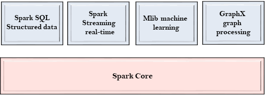

# Spark 组件(component)	

Spark项目由不同类型的紧密集成组件组成。Spark是一个计算引擎，可以组织，分发和监控多个应用程序。

下面我们来详细了解每个Spark组件。

#### Spark Core

- Spark Core是Spark的核心，并执行核心功能。
- 它包含用于任务调度，故障恢复，与存储系统和内存管理交互的组件。

#### Spark SQL

- Spark SQL构建于Spark Core之上，它为结构化数据提供支持。
- 它允许通过SQL(结构化查询语言)以及SQL的Apache Hive变体(称为HQL(Hive查询语言))查询数据。
- 它支持JDBC和ODBC连接，这些连接建立Java对象与现有数据库，数据仓库和商业智能工具之间的关系。
- 它还支持各种数据源，如Hive表，Parquet和JSON。

#### Spark Streaming

- Spark Streaming是一个Spark组件，支持流数据的可伸缩和容错处理。
- 它使用Spark Core的快速调度功能来执行流分析。
- 它接受小批量数据并对数据执行RDD转换。
- 它的设计确保为流数据编写的应用程序可以重复使用，只需很少的修改即可分析批量的历史数据。
- Web服务器生成的日志文件可以视为数据流的实时示例。

#### MLlib

- MLlib是一个机器学习库，包含各种机器学习算法。
- 它包括相关性和假设检验，分类和回归，聚类和主成分分析。
- 它比Apache Mahout使用的基于磁盘的实现快9倍。

#### GraphX

- GraphX是一个用于操作图形和执行图形并行计算的库。
- 它有助于创建一个有向图，其中任意属性附加到每个顶点和边。
- 要操纵图形，它支持各种基本运算符，如子图，连接顶点和聚合消息。