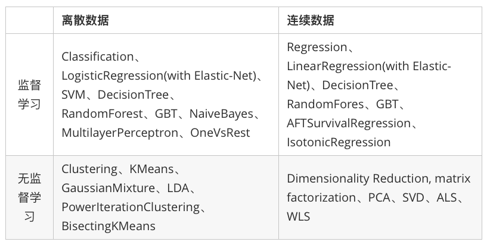

# Spark MLlib

MLlib是Spark的机器学习（Machine Learning）库，旨在简化机器学习的工程实践工作，并方便扩展到更大规模。MLlib由一些通用的学习算法和工具组成，包括分类、回归、聚类、协同过滤、降维等，同时还包括底层的优化原语和高层的管道API。具体来说，其主要包括以下几方面的内容：

1. 算法工具：常用的学习算法，如分类、回归、聚类和协同过滤；
2. 特征化工具：特征提取、转化、降维，和选择工具；
3. 管道(Pipeline)：用于构建、评估和调整机器学习管道的工具;
4. 持久性：保存和加载算法，模型和管道;
5. 实用工具：线性代数，统计，数据处理等工具。

Spark 机器学习库从 1.2 版本以后被分为两个包：

- `spark.mllib `包含基于RDD的原始算法API。Spark MLlib 历史比较长，在1.0 以前的版本即已经包含了，提供的算法实现都是基于原始的 RDD。
- [`spark.ml`](http://spark.apache.org/docs/latest/ml-guide.html) 则提供了基于[DataFrames](http://spark.apache.org/docs/latest/sql-programming-guide.html#dataframes) 高层次的API，可以用来构建机器学习工作流（PipeLine）。ML Pipeline 弥补了原始 MLlib 库的不足，向用户提供了一个基于 DataFrame 的机器学习工作流式 API 套件。

使用 ML Pipeline API可以很方便的把数据处理，特征转换，正则化，以及多个机器学习算法联合起来，构建一个单一完整的机器学习流水线。这种方式给我们提供了更灵活的方法，更符合机器学习过程的特点，也更容易从其他语言迁移。Spark官方推荐使用spark.ml。如果新的算法能够适用于机器学习管道的概念，就应该将其放到spark.ml包中，如：特征提取器和转换器。开发者需要注意的是，从Spark2.0开始，基于RDD的API进入维护模式（即不增加任何新的特性），并预期于3.0版本的时候被移除出MLLib。因此，我们将以ml包为主进行介绍。

Spark在机器学习方面的发展非常快，目前已经支持了主流的统计和机器学习算法。纵观所有基于分布式架构的开源机器学习库，MLlib可以算是计算效率最高的。MLlib目前支持4种常见的机器学习问题: 分类、回归、聚类和协同过滤。下表列出了目前MLlib支持的主要的机器学习算法：

