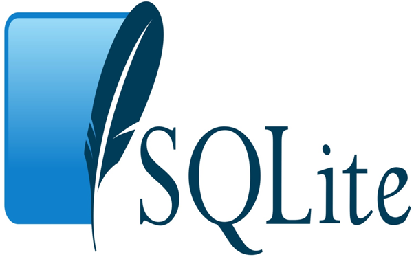

# SQLite 简介

SQLite是嵌入式关系数据库管理系统。 它是独立的，无服务器的，零配置和事务性SQL数据库引擎。

SQLite可以自由地用于商业或私有的任何目的。 换句话说，“SQLite是一种开源，零配置，独立的，独立的，旨在嵌入到应用程序中的事务关系数据库引擎”。

SQLite与其他SQL数据库不同，SQLite没有单独的服务器进程。 它直接读取和写入普通磁盘文件。 具有多个表，索引，触发器和视图的完整SQL数据库包含在单个磁盘文件中。

## SQLite特性/为什么要使用SQLite？ 			

以下是为什么SQLite比其他轻量级数据库受欢迎的功能列表：

- SQLite是完全免费的：SQLite是开源的。 因此，不需要许可证就可以自由地使用它。
- SQLite是无服务器的：SQLite不需要服务器进程或系统来操作。
- SQLite非常灵活：它可以在同一个会话上同时处理多个数据库。
- SQLite不需要配置：SQLite无需设置或管理。
- SQLite是一个跨平台的数据库系统：除了在大多数平台，如Windows，Mac OS，Linux和Unix。 它也可以用于许多嵌入式操作系统，如Symbian,Android和Windows CE上使用。
- 存储数据很容易：SQLite提供了一种有效的数据存储方式。
- 列长度可变：列的长度是可变的，不是固定的。 它有助于您只分配一个字段所需的空间。 例如，如果您有一个`varchar(200)`的列，并且在其上放置了一个`10`个字符的长度值，那么SQLite将仅为该值分配`20`个字符的空间，而不是整个`200`个空间。
- 提供大量的API：SQLite为大多数的编程语言提供了API。 例如：`.Net`语言(Visual Basic，C＃)，PHP，Java，Objective C，Python和许多其他编程语言提供了相应的API。
- SQLite是用ANSI-C编写的，提供简单易用的API。
- SQLite在UNIX(Linux，Mac OS-X，Android，iOS)和Windows(Win32，WinCE，WinRT)上均可用。

## SQLite历史 			

SQLite最初是在2000年8月设计的。它被命名为SQLite，因为它与其他数据库管理系统(如SQL Server或Oracle)不同，它是非常轻量的(小于500Kb大小)。

| 年份 | 有关事件                                                     |
| ---- | ------------------------------------------------------------ |
| 2000 | SQLite由D. Richard Hipp设计，目的是不需要管理程序的管理。    |
| 2000 | 在8月份，SQLite 1.0与GNU数据库管理器一起发布。               |
| 2011 | Hipp宣布将UNQl接口添加到SQLite数据库并开发UNQLite(面向文档的数据库)。 |

## SQLite优点和缺点 			

**SQLite的优点**

- SQLite是一个非常轻量级的数据库。 因此在电脑，手机，相机，家用电子设备等设备的嵌入式软件是非常好的选择。
- SQLite的数据存储非常简单高效。 当您需要存储文件存档时，SQLite可以生成较小数据量的存档，并且包含常规ZIP存档的大量元数据。
- SQLite可以用作临时数据集，以对应用程序中的一些数据进行一些处理。
- 在SQLite数据库中，数据查询非常简单。 您可以将数据加载到SQLite内存数据库中，并随时提取数据。可以按照您想要的方式提取数据。
- SQLite提供了一种简单有效的方式来处理数据，而不是以内存变量来做数据处理。 例如：如果您正在开发一个程序，并且有一些记录要对其进行一些计算。 然后，您可以创建一个SQLite数据库并在其中插入记录，查询，可以选择记录并直接进行所需的计算。
- SQLite非常容易学习和使用。它不需要任何安装和配置。只需复制计算机中的SQLite库，就可以创建数据库了。

**SQLite的缺点**

- SQLite一般用于处理小到中型数据存储，对于高并发高流量的应用不适用。