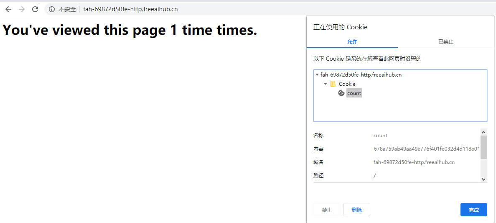
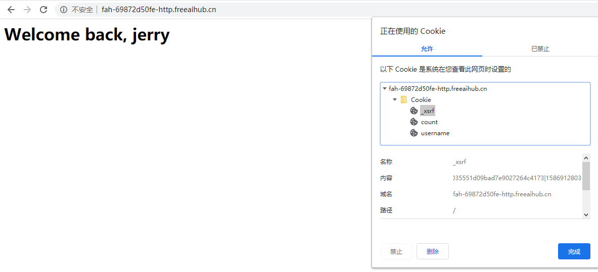

# Tornado 第六章：编写安全应用

很多时候，安全应用是以牺牲复杂度（以及开发者的头痛）为代价的。Tornado Web服务器从设计之初就在安全方面有了很多考虑，使其能够更容易地防范那些常见的漏洞。安全cookies防止用户的本地状态被其浏览器中的恶意代码暗中修改。此外，浏览器cookies可以与HTTP请求参数值作比较来防范跨站请求伪造攻击。在本章中，我们将看到使防范这些漏洞更简单的Tornado功能，以及使用这些功能的一个用户验证示例。

## 6.1 Cookie漏洞

许多网站使用浏览器cookies来存储浏览器会话间的用户标识。这是一个简单而又被广泛兼容的方式来存储跨浏览器会话的持久状态。不幸的是，浏览器cookies容易受到一些常见的攻击。本节将展示Tornado是如何防止一个恶意脚本来篡改你应用存储的cookies的。

### 6.1.1 Cookie伪造

有很多方式可以在浏览器中截获cookies。JavaScript和Flash对于它们所执行的页面的域有读写cookies的权限。浏览器插件也可由编程方法访问这些数据。跨站脚本攻击可以利用这些访问来修改访客浏览器中cookies的值。

### 6.1.2 安全Cookies

Tornado的安全cookies使用加密签名来验证cookies的值没有被服务器软件以外的任何人修改过。因为一个恶意脚本并不知道安全密钥，所以它不能在应用不知情时修改cookies。

#### 6.1.2.1 使用安全Cookies
Tornado的set_secure_cookie()和get_secure_cookie()函数发送和取得浏览器的cookies，以防范浏览器中的恶意修改。为了使用这些函数，你必须在应用的构造函数中指定cookie_secret参数。让我们来看一个简单的例子。

代码清单6-1中的应用将渲染一个统计浏览器中页面被加载次数的页面。如果没有设置cookie（或者cookie已经被篡改了），应用将设置一个值为1的新cookie。否则，应用将从cookie中读到的值加1。

代码清单6-1 安全Cookie示例：cookie_counter.py

文件名:cookie_counter.py

```python
import tornado.httpserver
import tornado.ioloop
import tornado.web
import tornado.options

from tornado.options import define, options
define("port", default=80, help="run on the given port", type=int)

class MainHandler(tornado.web.RequestHandler):
    def get(self):
        cookie = self.get_secure_cookie("count")
        count = int(cookie) + 1 if cookie else 1

        countString = "1 time" if count == 1 else "%d times" % count

        self.set_secure_cookie("count", str(count))

        self.write(
            '<html><head><title>Cookie Counter</title></head>'
            '<body><h1>You\'ve viewed this page %s times.</h1>' % countString + 
            '</body></html>'
        )

if __name__ == "__main__":
    tornado.options.parse_command_line()

    settings = {
        "cookie_secret": "bZJc2sWbQLKos6GkHn/VB9oXwQt8S0R0kRvJ5/xJ89E="
    }

    application = tornado.web.Application([
        (r'/', MainHandler)
    ], **settings)

    http_server = tornado.httpserver.HTTPServer(application)
    http_server.listen(options.port)
    tornado.ioloop.IOLoop.instance().start()
```

运行服务器:

```
python /share/lesson/tornado/cookie_counter.py
```

打开浏览器访问{url},并你检查浏览器中的cookie值。刷新页面看看页面上的计次有没有变化？



会发现count储存的值类似于MQ==|1310335926|8ef174ecc489ea963c5cdc26ab6d41b49502f2e2。Tornado将cookie值编码为Base-64字符串，并添加了一个时间戳和一个cookie内容的HMAC签名。如果cookie的时间戳太旧（或来自未来），或签名和期望值不匹配，get_secure_cookie()函数会认为cookie已经被篡改，并返回None，就好像cookie从没设置过一样。

传递给Application构造函数的cookie_secret值应该是唯一的随机字符串。在Python shell下执行下面的代码片段将产生一个你自己的值：

文件名:generate_cookie_secret.py

```python
import base64, uuid
print base64.b64encode(uuid.uuid4().bytes + uuid.uuid4().bytes)
```

```bash
python /share/lesson/tornado/generate_cookie_secret.py
```

多运行几次，看看返回的值有没有变化？


然而，Tornado的安全cookies仍然容易被窃听。攻击者可能会通过脚本或浏览器插件截获cookies，或者干脆窃听未加密的网络数据。记住cookie值是*签名*的而不是*加密*的。恶意程序能够读取已存储的cookies，并且可以传输他们的数据到任意服务器，或者通过发送没有修改的数据给应用伪造请求。因此，避免在浏览器cookie中存储敏感的用户数据是非常重要的。

我们还需要注意用户可能修改他自己的cookies的可能性，这会导致提权攻击。比如，如果我们在cookie中存储了用户已付费的文章剩余的浏览数，我们希望防止用户自己更新其中的数值来获取免费的内容。httponly和secure属性可以帮助我们防范这种攻击。

#### 6.1.2.2 HTTP-Only和SSL Cookies
Tornado的cookie功能依附于Python内建的Cookie模块。因此，我们可以利用它所提供的一些安全功能。这些安全属性是HTTP cookie规范的一部分，并在它可能是如何暴露其值给它连接的服务器和它运行的脚本方面给予浏览器指导。比如，我们可以通过只允许SSL连接的方式减少cookie值在网络中被截获的可能性。我们也可以让浏览器对JavaScript隐藏cookie值。

为cookie设置secure属性来指示浏览器只通过SSL连接传递cookie。（这可能会产生一些困扰，但这不是Tornado的安全cookies，更精确的说那种方法应该被称为*签名*cookies。）从Python 2.6版本开始，Cookie对象还提供了一个httponly属性。包括这个属性指示浏览器对于JavaScript不可访问cookie，这可以防范来自读取cookie值的跨站脚本攻击。

为了开启这些功能，你可以向set_cookie和set_secure_cookie方法传递关键字参数。比如，一个安全的HTTP-only cookie（不是Tornado的签名cookie）可以调用`self.set_cookie('foo', 'bar', httponly=True, secure=True)`发送。

既然我们已经探讨了一些保护存储在cookies中的持久数据的策略，下面让我们看看另一种常见的攻击载体。下一节我们将看到一种防范向你的应用发送伪造请求的恶意网站。

## 6.2 请求漏洞

任何Web应用所面临的一个主要安全漏洞是跨站请求伪造，通常被简写为CSRF或XSRF，发音为"sea surf"。这个漏洞利用了浏览器的一个允许恶意攻击者在受害者网站注入脚本使未授权请求代表一个已登录用户的安全漏洞。让我们看一个例子。

### 6.2.1 剖析一个XSRF

假设Alice是Burt's Books的一个普通顾客。当她在这个在线商店登录帐号后，网站使用一个浏览器cookie标识她。现在假设一个不择手段的作者，Melvin，想增加他图书的销量。在一个Alice经常访问的Web论坛中，他发表了一个带有HTML图像标签的条目，其源码初始化为在线商店购物的URL。比如：

```

```

Alice的浏览器尝试获取这个图像资源，并且在请求中包含一个合法的cookies，并不知道取代小猫照片的是在线商店的购物URL。

### 6.2.2 防范请求伪造

有很多预防措施可以防止这种类型的攻击。首先你在开发应用时需要深谋远虑。任何会产生副作用的HTTP请求，比如点击购买按钮、编辑账户设置、改变密码或删除文档，都应该使用HTTP POST方法。无论如何，这是良好的RESTful做法，但它也有额外的优势用于防范像我们刚才看到的恶意图像那样琐碎的XSRF攻击。但是，这并不足够：一个恶意站点可能会通过其他手段，如HTML表单或XMLHTTPRequest API来向你的应用发送POST请求。保护POST请求需要额外的策略。

为了防范伪造POST请求，我们会要求每个请求包括一个参数值作为令牌来匹配存储在cookie中的对应值。我们的应用将通过一个cookie头和一个隐藏的HTML表单元素向页面提供令牌。当一个合法页面的表单被提交时，它将包括表单值和已存储的cookie。如果两者匹配，我们的应用认定请求有效。

由于第三方站点没有访问cookie数据的权限，他们将不能在请求中包含令牌cookie。这有效地防止了不可信网站发送未授权的请求。正如我们看到的，Tornado同样会让这个实现变得简单。

### 6.2.3 使用Tornado的XSRF保护

你可以通过在应用的构造函数中包含xsrf_cookies参数来开启XSRF保护：

```python
settings = {
    "cookie_secret": "bZJc2sWbQLKos6GkHn/VB9oXwQt8S0R0kRvJ5/xJ89E=",
    "xsrf_cookies": True
}
application = tornado.web.Application([
    (r'/', MainHandler),
    (r'/purchase', PurchaseHandler),
], **settings)
```

当这个应用标识被设置时，Tornado将拒绝请求参数中不包含正确的_xsrf值的POST、PUT和DELETE请求。Tornado将会在幕后处理_xsrf cookies，但你必须在你的HTML表单中包含XSRF令牌以确保授权合法请求。要做到这一点，只需要在你的模板中包含一个xsrf_form_html调用即可：

```python
<form action="/purchase" method="POST">
    
    <input type="text" name="title" />
    <input type="text" name="quantity" />
    <input type="submit" value="Check Out" />
</form>
```

#### 6.2.3.1 XSRF令牌和AJAX请求

AJAX请求也需要一个_xsrf参数，但不是必须显式地在渲染页面时包含一个_xsrf值，而是通过脚本在客户端查询浏览器获得cookie值。下面的两个函数透明地添加令牌值给AJAX POST请求。第一个函数通过名字获取cookie，而第二个函数是一个添加_xsrf参数到传递给postJSON函数数据对象的便捷函数。

```python
function getCookie(name) {
    var c = document.cookie.match("\\b" + name + "=([^;]*)\\b");
    return c ? c[1] : undefined;
}

jQuery.postJSON = function(url, data, callback) {
    data._xsrf = getCookie("_xsrf");
    jQuery.ajax({
        url: url,
        data: jQuery.param(data),
        dataType: "json",
        type: "POST",
        success: callback
    });
}
```

这些预防措施需要思考很多，而Tornado的安全cookies支持和XSRF保护减轻了应用开发者的一些负担。可以肯定的是，内建的安全功能也非常有用，但在思考你应用的安全性方面需要时刻保持警惕。有很多在线Web应用安全文献，其中一个更全面的实践对策集合是Mozilla的[安全编程指南](https://wiki.mozilla.org/WebAppSec/Secure_Coding_Guidelines)。

## 6.3 用户验证

既然我们已经看到了如何安全地设置和取得cookies，并理解了XSRF攻击背后的原理，现在就让我们看一个简单用户验证系统的演示示例。在本节中，我们将建立一个应用，询问访客的名字，然后将其存储在安全cookie中，以便之后取出。后续的请求将认出回客，并展示给她一个定制的页面。你将学到login_url参数和tornado.web.authenticated装饰器的相关知识，这将消除在类似应用中经常会涉及到的一些头疼的问题。

### 6.3.1 示例：欢迎回来

在这个例子中，我们将只通过存储在安全cookie里的用户名标识一个人。当某人首次在某个浏览器（或cookie过期后）访问我们的页面时，我们展示一个登录表单页面。表单作为到LoginHandler路由的POST请求被提交。post方法的主体调用set_secure_cookie()来存储username请求参数中提交的值。

代码清单6-2中的Tornado应用展示了我们本节要讨论的验证函数。LoginHandler类渲染登录表单并设置cookie，而LogoutHandler类删除cookie。

代码清单6-2 验证访客：cookies.py

```python
import tornado.httpserver
import tornado.ioloop
import tornado.web
import tornado.options
import os.path

from tornado.options import define, options
define("port", default=80, help="run on the given port", type=int)

class BaseHandler(tornado.web.RequestHandler):
    def get_current_user(self):
        return self.get_secure_cookie("username")

class LoginHandler(BaseHandler):
    def get(self):
        self.render('login.html')

    def post(self):
        self.set_secure_cookie("username", self.get_argument("username"))
        self.redirect("/")

class WelcomeHandler(BaseHandler):
    @tornado.web.authenticated
    def get(self):
        self.render('index.html', user=self.current_user)

class LogoutHandler(BaseHandler):
    def get(self):
        if(self.get_argument("logout", None)):
            self.clear_cookie("username")
            self.redirect("/")

if __name__ == "__main__":
    tornado.options.parse_command_line()

    settings = {
        "template_path": os.path.join(os.path.dirname(__file__), "templates"),
        "cookie_secret": "bZJc2sWbQLKos6GkHn/VB9oXwQt8S0R0kRvJ5/xJ89E=",
        "xsrf_cookies": True,
        "login_url": "/login"
    }

    application = tornado.web.Application([
        (r'/', WelcomeHandler),
        (r'/login', LoginHandler),
        (r'/logout', LogoutHandler)
    ], **settings)

    http_server = tornado.httpserver.HTTPServer(application)
    http_server.listen(options.port)
    tornado.ioloop.IOLoop.instance().start()
```

代码清单6-3和6-4是应用/目录下的文件。

代码清单6-3 登录表单：templates/login.html

```html
<html>
    <head>
        <title>Please Log In</title>
    </head>

    <body>
        <form action="/login" method="POST">
            
            Username: <input type="text" name="username" />
            <input type="submit" value="Log In" />
        </form>
    </body>
</html>
```

代码清单6-4 欢迎回客：templates/index.html

```html
<html>
    <head>
        <title>Welcome Back!</title>
    </head>
    <body>
        <h1>Welcome back, {{ user }}</h1>
    </body>
</html>
```

运行服务器

```bash
python /share/lesson/tornado/cookie.py
```

然后访问{url}/login,看看，输入用户名jerry，看看是否会出现如下结果



### 6.3.2 authenticated装饰器

为了使用Tornado的认证功能，我们需要对登录用户标记具体的处理函数。我们可以使用@tornado.web.authenticated装饰器完成它。当我们使用这个装饰器包裹一个处理方法时，Tornado将确保这个方法的主体只有在合法的用户被发现时才会调用。让我们看看例子中的WelcomeHandler吧，这个类只对已登录用户渲染index.html模板。

```python
class WelcomeHandler(BaseHandler):
    @tornado.web.authenticated
    def get(self):
        self.render('index.html', user=self.current_user)
```

在get方法被调用之前，authenticated装饰器确保current_usr属性有值。（我们将简短的讨论这个属性。）如果current_user值为假（None、False、0、""），任何GET或HEAD请求都将把访客重定向到应用设置中login_url指定的URL。此外，非法用户的POST请求将返回一个带有403（Forbidden）状态的HTTP响应。

如果发现了一个合法的用户，Tornado将如期调用处理方法。为了实现完整功能，authenticated装饰器依赖于current_user属性和login_url设置，我们将在下面看到具体讲解。

#### 6.3.2.1 current_user属性

请求处理类有一个current_user属性（同样也在处理程序渲染的任何模板中可用）可以用来存储为当前请求进行用户验证的标识。其默认值为None。为了authenticated装饰器能够成功标识一个已认证用户，你必须覆写请求处理程序中默认的get_current_user()方法来返回当前用户。

实际的实现由你决定，不过在这个例子中，我们只是从安全cookie中取出访客的姓名。很明显，你希望使用一个更加鲁棒的技术，但是出于演示的目的，我们将使用下面的方法：

```python
class BaseHandler(tornado.web.RequestHandler):
    def get_current_user(self):
        return self.get_secure_cookie("username")
```

尽管这里讨论的例子并没有在存储和取出用户密码或其他凭证上有所深入，但本章中讨论的技术可以以最小的额外努力来扩展到查询数据库中的认证。

#### 6.3.2.2 login_url设置

让我们简单看看应用的构造函数。记住这里我们传递了一个新的设置给应用：login_url是应用登录表单的地址。如果get_current_user方法返回了一个假值，带有authenticated装饰器的处理程序将重定向浏览器的URL以便登录。

```python
settings = {
    "template_path": os.path.join(os.path.dirname(__file__), "templates"),
    "cookie_secret": "bZJc2sWbQLKos6GkHn/VB9oXwQt8S0R0kRvJ5/xJ89E=",
    "xsrf_cookies": True,
    "login_url": "/login"
}
application = tornado.web.Application([
    (r'/', WelcomeHandler),
    (r'/login', LoginHandler),
    (r'/logout', LogoutHandler)
], **settings)
```

当Tornado构建重定向URL时，它还会给查询字符串添加一个next参数，其中包含了发起重定向到登录页面的URL资源地址。你可以使用像self.redirect(self.get_argument('next', '/'))这样的行来重定向登录后用户回到的页面。

## 6.4 总结

我们在本章中看到了两种帮助你的Tornado应用安全的技术，以及一个如何使用@tornado.web.authenticated实现用户认证的例子。在[第七章]，我们将看到在那些像Facebook和Twitter一样需要外部Web服务认证的应用中如何扩展我们这里谈论的概念。