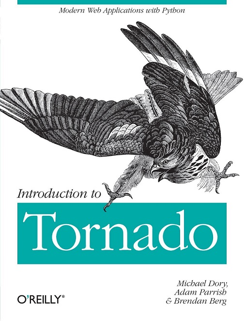

# 如何学习本课程

## 课程信息

- 课程名称：《Introduction to Tornado》《动手学Tornado》
- 课程编号：B45
- 所需基础：[Python](/python),[Linux](/linux),[Vim](/vim),[HTML](/html)
- 学习周期：2周（以每天投入1小时左右时间进行学习估算）
- 学习形式：在线互动[课程使用帮助](/aboutus/help.html)
- 面向群体：希望使用Python构架网站的同学
- 学习成果：可使用Tornado快速搭建安全，高效的Web网站。
- 课程说明：本课程为对[Introduction to Tornado](http://demo.pythoner.com/itt2zh/index.html)这本书籍的整理，修正了代码中的错误，重新规范了书中项目的文件名，路径，除了书中涉及到墙外而无法在线运行的章节（第七章），其余均正常在线进行运行。方便用户进行所见即所得式的学习。

## 本课程专用微信学习交流群 

如果您还有学习过程中需要有交流，困惑，请加入下方互动学习微信群

## 相关资料推荐

| 类别 | 名称                                                         |
| ---- | ------------------------------------------------------------ |
| 视频 | [千锋Tornado全集](https://www.bilibili.com/video/BV1r4411j7vn) |
| 书籍 | 在线书籍:[Introduction to Tornado](http://demo.pythoner.com/itt2zh/index.html) 代码:[Github](https://github.com/Introduction-to-Tornado) |

