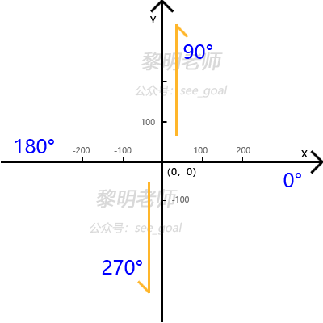
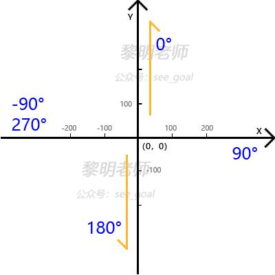

# turtle 入门篇

**turtle**图形库源于1966年诞生的Logo语言，是入门Python的有趣工具。因其简单便捷的图形化方法、和立即反馈式的绘画效果，成为众多编程入门者的首选。相对于大多数入门教材中枯燥的语法学习，和函数、方法的演练来说，**turtle**的趣味性显得别具一格、极富效果。

一直希望能用一篇小短文来讲清楚**turtle**，但是尝试组织了几次之后，感觉一篇文章门槛还是有点高，最终决定还是分成两篇，即大家现在看到的“初级篇”和“高级篇”，以利更好的分层次阐述。

一个类库是否利于入门，首先了要解它的背景，它能做什么，不能做什么，没有十全十美的事物，不要期望过高。**turtle**原意是水生的龟类，可以译成海龟或乌龟。是由1966年Wally Feurzig和Seymour Papert开发出的一种简单易用的编程语言。

我们这里的**turtle**库，指的是**turtle**语言用Python的实现，**turtle**库现在已进入Python的内置模块，位于Lib/**turtle**.py，用于绘图。

咱们这里选择**turtle**库，主要是用来了解和学习Python的贴身入门、语法入门、面向对像入门、认识方向、角度与颜色、简单的数学运算、方法定义、循环与递归等。

在使用**turtle**库之前最重要的事，是需要认识**turtle**的两个坐标、角度系统：standard和logo。如下图所示：



这里standard模式，也就是标准坐标系，在**turtle**库的使用过程中，默认使用这套坐标、角度系统，即**以绘图界面的中心点为坐标圆点(0,0)，以x坐标正方向为0度角，逆时针旋转**。不要小看这简单的三句话，这是最基础的约定前提，请熟记于胸，否则编程的时候，容易懵的。

除了standard标准坐标系外，在**turtle**库的编程中还经常使用另外一套坐标、角度系统，叫做logo！对，就是那个Logo，那个原来的独立编程语言，这套logo坐标、角度系统就是用来跟原logo兼容的，对于了解过Logo语言的用户来说，会更加熟悉，上图：



看出差别来了吗，logo坐标系是**以绘图界面的中心点为坐标圆点(0,0)，以y坐标正方向为0度角，顺时针旋转**。跟standard坐标不同的地方在于0度方向的选择，和旋转方式。在编程中使用 mode() 方法进行切换。

```python
# 切换坐标、角度系统
# mode('standard')
mode('logo')
```

所以，如果见到这个方法，您首先得切换自己大脑中的坐标、角度系统。：）这是编程的底层逻辑，必需先弄清楚。

接下来，再认识**turtle**的画图方式：落笔、抬笔、清空、设置颜色、粗细等等。

如何让这只乌龟在界面上画一条线呢，就如同咱们用笔写字一样，需要用经过“落笔”、“划过”、“抬笔”、“结束”的过程，用**turtle**库来表达，同样非常直观，翻译成简单的英文就可以：

文件名:basic1.py

```python
import turtle as t     # 导入turtle库
t.pendown()            # 落笔
t.forward(300)         # 划过300个单位的长度
t.penup()              # 抬笔
t.done()               # 结束
```

```bash
python3 /share/lesson/turtle/basic1.py
```

康康

用**turtle**画出了Python的第一条直线之后，接着来看看怎么“转弯”。下面以绘制一个正方形为例子，演示**turtle**怎么前进、怎么左转、右转。

文件名:basic2.py

```python
import turtle as t     # 导入turtle库
t.pendown()            # 落笔
t.forward(100)         # 划过100个单位的长度
t.left(90)             # 左转90度
t.forward(100)
t.left(90)
t.forward(100)
t.left(90)
t.forward(100)
t.left(90)
t.penup()              # 抬笔
t.done()               # 结束
```

```bash
python3 /share/lesson/turtle/basic2.py
```

康康

就能看到在窗口上画出了一个标准的正方形。

有一点编程基础的小伙伴，立即就可以看出来，上面代码中有四组相同的语句，嗯，这不是可以用循环来实现吗？没错，改进一下：

文件名:basic3.py

```python
import turtle as t
t.pendown()
for j in range(4):    # 重复执行4次
    t.forward(100)
    t.left(90)
t.penup()
t.done()
```

```bash
python3 /share/lesson/turtle/basic3.py
```

康康

可以看到效果跟顺序执行的完全一致。`range()`是Python的内置函数，这里表示循环执行的次数。


注意缩进，Python中不使用括号来表示语句块，而靠冒号:和后面的缩进(空格缩进)来表示语句块。因此缩进成为了语法的一部分，要严格遵循，从其它语言转过来的小伙伴需要习惯一下。

学习任何一项新知识，就像爬坡一样，有个量变积累到质变的过程。接下来就来写一个乌龟爬坡的小程序吧，

文件名:littleturtle.py

```python
import turtle as t
t.pendown()
t.forward(50)
t.left(90)             # 左转90度
t.forward(50)
t.right(90)            # 右转90度
t.forward(50)
t.left(90)
t.forward(50)
t.right(90)            # 右转90度
t.forward(50)
t.left(90)
t.forward(50)
t.right(90)            # 右转90度
t.penup()
t.done()
```

```bash
python3 /share/lesson/turtle/littleturtle.py
```

康康

可以看到一段3次爬坡的动画。

left(90)是向左转动90度；right(90)是向右转动90度。当然这3次爬坡，也是可以用顺序来做的

文件名:littleturtle1.py

```python
import turtle as t
t.pendown()
for j in range(3):         # 重复执行3次
    t.forward(50)
    t.left(90)             # 左转90度
    t.forward(50)
    t.right(90)            # 右转90度
t.penup()
t.done()
```

for循环的执行效果，跟顺序执行的完全一样，更改range(3)的参数，可以执行不同的次数。

```bash
python3 /share/lesson/turtle/littleturtle1.py
```

康康


彩蛋来了：**turtle**既然是乌龟，我怎么画到现在没有看到一只乌龟呢？的确有点奇怪，明明是一个小箭头一直在画画，为什么要说成是**turtle**乌龟呢？

不要着急，加一行小代码，乌龟立即出现：

```
t.shape('turtle')
```

把这行代码，加到“落笔”的前面，就会发现小箭头变成小乌龟了，还是挺萌吧！上面画直线、画正方形、爬坡三个例子你都可以加上试试试试！

上面的left(90)和right(90)分别表示左转90度和右转90度，那怎么设置乌龟的角度，让它向我们指定的任意方向前进呢？嗯，调整90这个参数，在界面上画一个自己的名字吧！哦，中文就算了，画出来太复杂，画个拼音首字母还是可以的，上代码：

文件名:letter.py

```python
import turtle as t
t.mode('logo')        # 切换成Logo坐标、角度系统
t.shape('turtle')     # 显示出小乌龟
t.penup()             # 抬笔，先不要画
t.goto(-200, 100)     # 移动到起始点
t.setheading(180)     # 设置要画的方面，Logo坐标的180度方向，即向下
t.pendown()           # 落笔，准备开始画第一个字母
t.forward(200)
t.left(90)
t.forward(100)
t.penup()             # 第一个字母"L"画完，抬笔

t.forward(100)        # 到达第二个字母的起始位置
t.pendown()           # 落笔，准备开始画第二个字母
t.left(90)
t.forward(200)
t.right(135)
t.forward(100)
t.left(90)
t.forward(100)
t.right(135)
t.forward(200)
t.penup()             # 第二个字母"M"画完，抬笔
t.done()
```

```bash
python3 /share/lesson/turtle/letter.py
```

康康

可以看到小乌龟在窗口左侧画了两个大写的字母“L”和“M”。


需要注意的地方是，程序中使用mode('logo')切换到了Logo的坐标、角度系统，setheading(180)将小乌龟的前进方向设置为Logo坐标的180度方向，即向下的方向，如果有疑问，可以参考本文开篇时对坐标系的描述。

goto(x, y)是一个新方法，可以让小乌龟去到界面上的任意一个坐标点。（当然，画名字的这个小例子，如果全部使用goto(x,y)会比使用forward()要简单很多，具体代码你可以自己尝试）

配合for循环、forward()和角度度化，可以让**turtle**在变与不变中创造出很多有意思的图形。比如把上面画正方形的例子稍做变化：

文件名:square.py

```python
import turtle as t
t.pendown()
for j in range(10):    # 重复执行10次
    # 画正方形-开始
    t.forward(100)         
    t.left(90)
    t.forward(100)
    t.left(90)
    t.forward(100)
    t.left(90)
    t.forward(100)
    t.left(90)             # 画正方形-结束
    # 右转36度
    t.right(36)            
t.penup()
t.done()
```

```bash
python3 /share/lesson/turtle/square.py
```

康康

执行后可以看到，画出一个非常规整、漂亮的组合图案。


填充，可以让**turtle**的图形更炫丽。主要有以下几个方法：

```python
t.pencolor('red')        #设置画笔的颜色
t.fillcolor('green')     #设置填充的颜色
t.begin_fill()           #开始填充
t.end_fill()             #结束填充
```

下面来改造一下我们前面画正方形的例子

文件名:square-fill-color.py

```python
import turtle as t
t.pencolor('red')        #设置画笔的颜色
t.fillcolor('green')     #设置填充的颜色
t.pendown()
t.begin_fill()           #开始填充
for j in range(4):
    t.forward(100)
    t.left(90)
t.end_fill()             #结束填充
t.penup()
t.done()
```

```bash
python3 /share/lesson/turtle/square.py
```

康康

看到**turtle**画出一个红色边框的实心绿正方形。


在Python中使用def进行方法定义或者叫函数定义，可以让指挥**turtle**画画这件事，更轻松一点。再次改造一下上面画正方形的例子：

文件名:square-with-function.py

```python
import turtle as t

def drawRect():            # 定义一个函数，名为 drawRect()
    t.pendown()
    for j in range(4):
        t.forward(100)
        t.left(90)
    t.penup()
    
drawRect()                 # 调用这个函数
t.done()
```

在这个例子中，我们使用def定义了一个函数，名为drawRect()，内容就是带一个正方形，跟前面的描述一样。

自定义好函数以后，只要调用这个函数名，就可以执行函数体内的代码内容。

```bash
python3 /share/lesson/turtle/square-with-function.py
```

康康


我们再来丰富一下这个例子，对上面画多个正方形的例子进行优化：

文件名:square-multi.py

```python
import turtle as t

def drawRect():            # 定义函数
    t.pendown()
    for j in range(4):
        t.forward(100)
        t.left(90)
    t.penup()
    
for j in range(10):        # 重复执行10次
    drawRect()             # 调用这个自定义的函数
    t.right(36)
    
t.done()
```

```bash
python3 /share/lesson/turtle/square-multi.py
```

康康

可见效果一样，但是代码更为简洁，可读性更好。


下面给这段代码加上填充效果：

文件名:square-multi-fill-color.py

```python
import turtle as t

def drawRect():
    t.pendown()
    for j in range(4):
        t.forward(100)
        t.left(90)
    t.penup()
    
clrs = ['red', 'green', 'blue', 'gray', 'brown']　# 颜色列表
for j in range(10): 
    t.fillcolor(clrs[j % 5])                      # 从列表中选择颜色
    t.begin_fill()                                # 开始填充
    drawRect()
    t.end_fill()                                  # 结束填充
    t.right(36)
    
t.done()
```

```bash
python3 /share/lesson/turtle/square-multi-fill-color.py
```

康康

可以看到，**turtle**画出了用五种不同颜色填充的正方形组合图案。例子中为了使得每个正方形填充的颜色不一样，我们先定义了一个颜色列表clrs，列表clrs中预先存入了5个颜色。在for循环中，每次执行时根据j值的变化，用取余数%的方式，每次取到不重复的颜色。


当然，**turtle**的功能不只于此，对于Python的入门者来说，通过**turtle**生动的例子，可以画漂亮的图形，也可以同时熟悉Python的语法和规则，何乐而不为呢？
