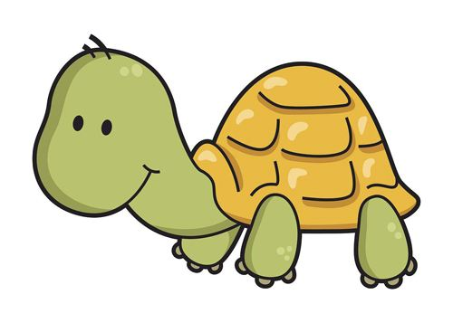

# turtle 简介

Python 语言中内置的海龟作图turtle 模块设计巧妙，主要是依据坐标轴来绘制图像，画笔则是一只小海龟，通过控制海龟的在坐标平面的移动，从而绘制各种各样的图像。

turtle库作图模型简单强大，能够让程序设计初学者很快编写出趣味生动的作图程序，极大提高编程学习的兴趣和积极性，在练习过程中培养和提高计算思维。

除了绘制图形之外，Python turtle 模块还具有基本的交互功能，加上学习门槛低，又是Python 语言内置的标准模块，所以非常适合作为创意编程的学习和开发平台。