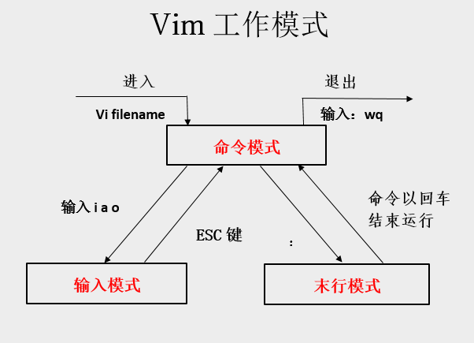

# Vim 基础操作

从本节开始，将了解Vim。 在本章中，将讨论了解以下主题内容 - 

- 启动Vim

- Vim模式

- 创建新文件

- 以只读模式查看文件

- 编辑现有文件

<iframe src="//player.bilibili.com/player.html?aid=37130822&bvid=BV1Yt411X7mu&cid=65249143&page=1" scrolling="no" border="0" frameborder="no" framespacing="0" allowfullscreen="true" width="100%" height="460"> </iframe>
## 启动Vim

Vim与基于GUI的编辑器略有不同，它可以从GUI和终端中启动和使用。

**使用图形启动器**

- 要从图形启动器启动Vim，只需双击gVim图标即可。它将打开编辑器窗口如下

**使用终端**

**打开VIM**

使用来自终端的Vim在Windows和Linux平台上都是相同的。

在右侧终端Linux环境下输入vim命令,它将在终端打开Vim

```bash
vim
```

**退出VIM**

要关闭它，请按**Esc**键，然后按冒号(`:`)和`q`。 在Vim中`q`命令代表退出。该命令将显示在编辑器本身的左下角

## Vim的模式

Vim支持多种模式。本节讨论将在日常使用的一些重要模式。



#### 命令模式

这是Vim启动的默认模式。可以在这种模式下输入编辑器命令。

在这种模式下使用各种命令，如复制，粘贴，删除，替换等等。在后面的章节中将详细讨论这些命令。

> **注 - 此处，任何没有冒号的Vim命令都表示正在命令模式下执行该命令。**

#### 插入模式

使用此模式输入/编辑文本。要从默认命令切换到插入模式，请按`i`键。它将在编辑器的左下角显示当前模式。
可以在插入模式下输入任何文本。

**按Esc键从此模式切换回命令模式。**

#### 命令行模式

此模式也用于输入命令。 此模式下的命令以冒号(`:`)开头。 例如，在上一节中，在此模式下输入了`quit`命令。可以从命令或插入模式进入此模式。

- 要从命令模式切换到此模式，只需键入冒号(`:`)。
- 要从插入模式切换到此模式，请按**Esc**键入，然后输入冒号。

在下图中，左下方的冒号表示行模式。

> 注 - 此后，任何以冒号开头的Vim命令表示正在命令行模式下执行该命令。

#### 视觉模式

在此模式下，可以直观地选择文本并在选定的部分上运行命令。要从命令模式切换到可视模式，请键入`v`
要从任何其他模式切换到可视模式，请先按**Esc**切换回命令模式，然后键入`v`切换到可视模式

在下面的图像左下角显示视觉模式。

## 使用Vim创建和保存新文件

执行以下命令打开Vim:

```bash
vim
```

- 在Vim环境中键入以下命令`:edit message.txt`

>  如果*message.txt*存在，则它将重新加载文件，否则会创建这个文件。

- 切换到插入模式，按`i`键:

- 输入一些文字或代码内容之类的。
- 切换回命令模式，按`Esc`键:

- 保存文件内容的更改,执行以下命令:`:w`

  现在将创建一个*message.txt*文件。

- 退出Vim`:q`

查看刚刚创建文件的内容

```bash
cat message.txt
```

## 以只读模式打开文件

使用`-R`选项以只读模式打开文件，执行以下操作:

```bash
vim -R message.txt
```

在Vim环境的左下角显示只读模式

或者，也可以使用`view`命令来实现相同的结果。`view message.txt`

## 编辑现有文件

执行以下步骤编辑现有文件

- 使用Vim打开文件

```bash
vim message.txt
```

按`i`切换到插入模式，然后写入一些文本。

- `:q!`退出编辑器而不保存更改

- 或者使用`:wq`保存更改并退出编辑器
